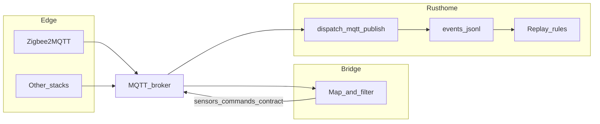

# Adapters and bridges

This document fixes **where rusthome ends** and **where edge adapters begin**. It complements [integration.md](integration.md) (golden paths) and [zigbee-conbee.md](zigbee-conbee.md) (Conbee / Zigbee2MQTT hardware).

## Responsibilities

| Layer | Owns | Does not own |
| ----- | ---- | ------------ |
| **rusthome core** ([`crates/core`](../crates/core), [`crates/rules`](../crates/rules), [`crates/app`](../crates/app), [`crates/infra`](../crates/infra)) | Event schema, journal, deterministic replay, rule evaluation | Zigbee, USB serial, vendor JSON, foreign MQTT topic trees |
| **rusthome serve** ([`crates/cli`](../crates/cli)) | Embedded MQTT broker (optional), ingest of **contract-shaped** topics, web UI | Translation from Zigbee2MQTT / deCONZ / HA topic shapes |
| **Bridge process** ([`rusthome-bridge`](../crates/bridge)) | Subscribe to upstream topics (e.g. Zigbee2MQTT), map payloads, **republish** to [`mqtt-contract.md`](mqtt-contract.md) topics on the **same** broker | Journal files, rules |

The FIFO engine **does not read sensors or the network** ([integration.md](integration.md)): only normalized observations and commands enter the journal. Bridges are **separate OS processes** (often `systemd` services) that turn messy reality into that normalization.

## Data flow

Same broker is typical: Zigbee2MQTT and `rusthome-bridge` and `rusthome serve` all use `localhost:1883` (embedded broker) or a shared Mosquitto instance.

## `mqtt_motion_ingest` vs `rusthome-bridge`

| Mechanism | Path | Use case |
| --------- | ---- | -------- |
| [`crates/app/examples/mqtt_motion_ingest.rs`](../crates/app/examples/mqtt_motion_ingest.rs) | Subscribes on an **external** broker, calls `dispatch_mqtt_publish`, **appends directly** to `events.jsonl` | Labs, single-process ingest **without** republishing; must align `--data-dir` and broker with your deployment |
| **`rusthome-bridge`** | Subscribes to **Zigbee2MQTT** (or similar), **republishes** `sensors/…` / `commands/…` on the broker | Production-style split: **`rusthome serve`** remains the only writer to the journal via its normal ingest loop |

Republish is the recommended pattern when using **`rusthome serve`**: one writer path into the journal avoids duplicate adapters and keeps causal ordering consistent with the embedded broker path.

## Recommended stack (Zigbee / Conbee)

1. **Zigbee2MQTT** + Conbee (or other coordinator) — see [zigbee-conbee.md](zigbee-conbee.md).
2. **Shared MQTT broker** with `rusthome serve` (embedded or Mosquitto).
3. **`rusthome-bridge`** with a config that maps each device / JSON key to [mqtt-contract.md](mqtt-contract.md) families (`temperature`, `humidity`, `contact`, `motion`).

Optional: [zigbee2mqtt] in `rusthome.toml` only affects **permit join** from the System page; it does not replace the bridge.

## Bridge reference

- Example config: [`configs/bridge.example.toml`](../configs/bridge.example.toml). Copy it to e.g. `configs/bridge.toml` (or `/etc/rusthome/bridge.toml`) and edit `[[devices]]` to match your Zigbee2MQTT `friendly_name` values. Local `configs/bridge.toml` is gitignored if you keep secrets there.
- Example unit: [`configs/rusthome-bridge.service`](../configs/rusthome-bridge.service).
- Build: `cargo build -p rusthome-bridge --release`.
- Run (dev): `RUST_LOG=info rusthome-bridge --config configs/bridge.toml`.

### systemd startup order

If `rusthome serve` provides the **embedded broker** on the same host, start **`rusthome-bridge` after `rusthome`** so TCP `:1883` is listening. The example unit uses `After=network-online.target rusthome.service`. For a **shared Mosquitto**, both units can depend on `mosquitto.service` instead; the bridge does not require rusthome to be up if the broker is already available.

## Adapter → bridge (quick reference)

| Upstream | Bridge approach | rusthome contract |
| -------- | ---------------- | ----------------- |
| Zigbee2MQTT | **`rusthome-bridge`** (this repo) | `sensors/…` per [mqtt-contract.md](mqtt-contract.md) |
| deCONZ / Phoscon | Custom bridge or MQTT plugin → republish | Same |
| Manual / scripts | `mosquitto_pub`, UI simulation, tests | Same |
| External HA / Node-RED | Flow that emits contract topics | Same |

## Operations, security, and versioning

### History and restarts

The bridge is **stateless** with respect to rusthome: it does not store Z2M history. **Long-term truth** for automation is the rusthome journal (`events.jsonl`). After a bridge restart, only **new** Z2M publishes are forwarded; rusthome state is rebuilt by replay.

### Broker authentication and TLS

For production, prefer a broker with **username/password** or **TLS** client configuration. The bridge supports credentials via config or environment variables (see comments in [`configs/bridge.example.toml`](../configs/bridge.example.toml)). Do not commit secrets; use `systemd` `EnvironmentFile` or similar.

### Contract versioning

When [mqtt-contract.md](mqtt-contract.md) **contract version** changes, update the bridge (payload shapes / topics) and document migration in [integration.md](integration.md) and [rules-changelog.md](rules-changelog.md) if rules depend on new observation kinds.

### Observability

Use `RUST_LOG=info` (or `debug`) for structured logs: source topic, translated publishes, parse errors. Metrics are optional; log volume is enough for early deployments.

## See also

- [mqtt-contract.md](mqtt-contract.md) — normative topic and payload rules (`mqtt_ingest`).
- [integration.md](integration.md) — checklist for adding sensors, `sensor_display.json`.
- [implementation.md](implementation.md) — crate layout and tests.
