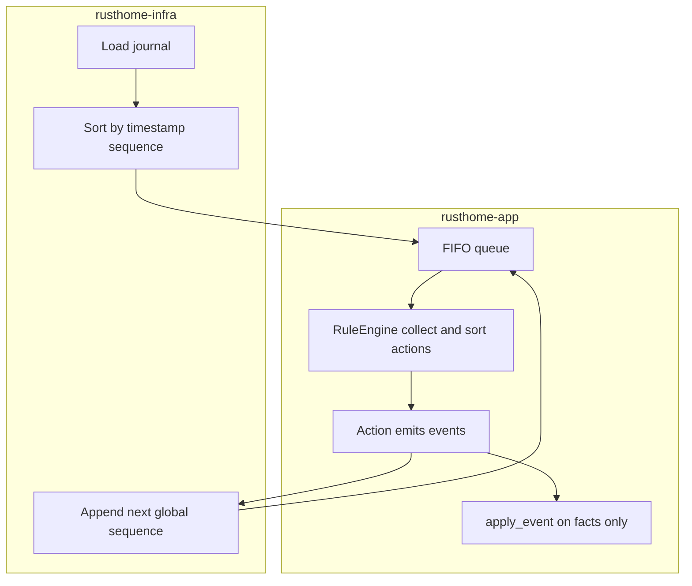

# Plan de conception — Système domotique déterministe (Rust)

Référence : [README.md](/home/pi/projects/rusthome/README.md). Le dépôt est actuellement vide côté code ; la structure `cmd/` + `internal/` du README est typique Go : en Rust on la traduit par un **workspace Cargo** et des **crates** nommées explicitement.

Ce document intègre des **décisions d’architecture figées**, des **barrières mécaniques**, une **causalité exploitable** (**§15**), des **transitions métier bornées** (**§6.17**), la **limite du graphe statique** (**§6.13**), les **oscillations métier** possibles malgré un moteur sain (**§6.18**), une **stratégie journal corrompu** (**§8.5**), le **compromis timestamp** (**§3.4**) et le **choix temps logique pur** (**§3.7**), des **obligations de charge / latence documentées** (**§7.1**), **réconciliation monde réel** et **taxonomie d’erreurs** (**§14.7–14.8**), **§14.6**, **§23**, et une **surface produit** (**§24**) avec réponses aux questions **latence**, **règles dangereuses avant prod**, **« pourquoi la lumière »**. **§19** étendu. **§7** single-node.

---

## 1. Cartographie README → Rust


| Concept README      | Réalisation Rust suggérée                                                                                 |
| ------------------- | --------------------------------------------------------------------------------------------------------- |
| Core (pur, sans IO) | Crate `rusthome-core` : types, traits, moteur pur                                                         |
| App (orchestration) | Crate `rusthome-app` : pipeline séquentielle (événement → règles → actions → append dérivés → suite FIFO) |
| Infra               | Crate `rusthome-infra` : persistance, **tri à la charge**, **seule** source du prochain `sequence` global |
| Interfaces          | Crate `rusthome-cli` (binaire) : clap + appels à `app`                                                    |
| Configs / data      | Dossiers à la racine du repo (chemins passés en args ou config)                                           |


**Principe** : `rusthome-core` ne dépend d’aucune autre crate du projet et n’a **aucune** dépendance réseau/fichier ; `chrono::Utc::now()` ou équivalent est **interdit** dans `core` et `app` pour la logique métier (sections 2.1, 2.4, 11 du README).

---

## 2. Structure de workspace proposée

```
rusthome/
  Cargo.toml                 # [workspace] members = [...]
  crates/
    core/                    # rusthome-core
    app/                     # rusthome-app
    infra/                   # rusthome-infra
    cli/                     # rusthome-cli ([[bin]])
  configs/
  data/
  docs/
```

- **docs/** : §3–§8.5, §4, §6 (jusqu’à §6.17 + §6.12.1), §14–§23, §19.
- Pas de dossier `internal/` obligatoire en Rust : `pub(crate)` par crate pour limiter la surface API.

---

## 3. Identité vs ordre — deux concepts séparés (décision figée)

### 3.1 Problème évité

- **Ne pas** utiliser un hash `(timestamp, type, payload)` comme clé d’ordre : collisions, dépendance à la sérialisation, fragilité de schéma.
- **Ne pas** utiliser un compteur **dérivé du seul ordre de traitement** comme seul identifiant : bootstrap et multi-source ambigus.

### 3.2 Modèle retenu


| Champ / concept                       | Rôle                                                                                                                                                                                                                                                                                                                                      |
| ------------------------------------- | ----------------------------------------------------------------------------------------------------------------------------------------------------------------------------------------------------------------------------------------------------------------------------------------------------------------------------------------- |
| `timestamp: i64`                      | **Temps logique** (ordonnancement + garde-fous métier dans les règles). **N’est pas** l’heure murale ni la **latence physique** — ne pas l’utiliser pour analytics « durée réelle » ou SLA sans spec additionnelle. En code le champ peut rester nommé `timestamp` ; la doc parle de **temps logique**. Égalités résolues par `sequence`. |
| `sequence: u64`                       | Tie-breaker global : **compteur monotone sur tout le journal**, assigné **uniquement** à l’**append** par l’infra (voir §3.3). **Persisté**.                                                                                                                                                                                              |
| `event_id: Uuid` (ou type équivalent) | Identifiant technique **unique** ; traçabilité ; **n’intervient pas** dans le tri global. Recommandé pour debug et corrélation.                                                                                                                                                                                                           |


**Ordre global unique** : trier **uniquement** par `(timestamp, sequence)` — **c’est tout**. Pas de tri secondaire sur `event_id`.

### 3.3 Décision figée — `sequence` globale monotone (**Option A**, seule option V0)

- **Une seule** politique : compteur **global** `0, 1, 2, 3, …` strictement croissant sur **tout** le journal, sans remise à zéro par `timestamp`.
- **Option B** (`sequence` par `timestamp`) est **exclue** pour la V0 (complexité, edge cases, pas nécessaire).
- L’**infra** maintient et incrémente ce compteur à **chaque** append (événements externes et synthétiques).
- **Conséquences** : format de log stable, replay sans ambiguïté, tests reproductibles.

### 3.4 Admission du `timestamp` à l’append — **monotone** (Option A, V0 figée)

- **Problème** : deux événements externes E1 (`timestamp = 100`) et E2 (`timestamp = 10`) triés par `(timestamp, sequence)` font traiter **E2 avant E1** → **causalité métier** (telle que portée par le temps logique) **cassée** si on accepte tout sans filtre.
- **V0 — Option A (seule option retenue)** : à **chaque append** (live), l’**infra** maintient `last_timestamp_committed` (sur le journal du nœud). Tout nouvel enregistrement avec `timestamp < last_timestamp_committed` est **rejeté** avec erreur typée explicite (**pas** d’append, **pas** de `sequence` consommée). Égalité `timestamp == last` est **autorisée** (plusieurs événements au même temps logique ; tie-break par `sequence` §3.2). Après append réussi, `last_timestamp_committed = max(last, timestamp)`.
- **Replay** : on **ne** réapplique **pas** cette gate comme si c’était du live — on **relit** le journal **tel quel** (déjà trié, §5). La gate protège **l’ingestion** contre les producteurs désordonnés ou mal horlogés, pas l’histoire persistée.
- **Option B (non retenue V0)** : accepter le désordre des `timestamp` entrants → le système est **logiquement non causal** au sens temps-logique ; il faudrait une **causalité explicite** indépendante du `timestamp` (ex. vecteurs d’horloge, DAG) — **hors périmètre V0**.
- **Hypothèse produit V0 (à documenter pour les intégrateurs)** : la gate monotone n’est **robuste** que si l’**ingestion** vers le writer unique présente les événements avec des `timestamp` **déjà cohérents** avec l’ordre métier attendu. **Modèle assumé** : **une file d’ordonnancement** (ou **un seul producteur** séquentiel) avant `append` ; **pas** plusieurs capteurs / brokers **async** écrivant **directement** le même journal **sans** couche qui **réordonne** ou **normalise** les temps logiques. Sinon : rejets « valables » ou ordre faux — **non robuste** sans cette couche. Toute évolution **multi-source** réelle = **nouvelle spec** (souvent Option B + causalité dédiée).
- **Compromis explicite (à afficher côté produit / runbook)** : le système V0 **sacrifie la complétude historique** des événements **tardifs** portant un `timestamp` **strictement inférieur** au dernier commit (**rejet** §3.4) au profit de la **cohérence temporelle stricte** du journal tel qu’ordonné. **Ne pas** « corriger » cela ad hoc (réordonner ou réécrire le passé) **sans nouvelle spec** — sinon le modèle **déterministe** est cassé. Pour **ingérer** des événements retardés : **normaliser** les temps logiques **avant** `append` (couche amont) **ou** accepter la perte.

### 3.5 Payload, type — **trois familles** : **Fact** / **Command** / **Observation**

- **V0 obligatoire** : modèle algébrique explicite du style `Event::Fact(FactEvent)` / `Event::Command(CommandEvent)` / `Event::Observation(ObservationEvent)` (noms exacts libres ; **trois familles disjointes**).
- **Fact** : vérité de **projection** que le système enregistre ; seul chemin vers `apply_event` (§4).
- **Command** : **intention** (utilisateur, scénario, automation) ; **jamais** `apply_event` ; routé vers le moteur de règles (§6.4).
- **Observation** : **signal du monde extérieur** tel que **rapporté** au système (ex. capteur « motion », température lue). **Ni** une affirmation de vérité projetée **ni** une intention : c’est une **donnée d’entrée** pour les règles. **Ne passe pas** par `apply_event`. Les règles peuvent en déduire des **facts** ou des **commandes** selon le domaine.
- Chaque variante porte son payload typé ; sérialisation journal : tag discriminant stable (**§8.3**).
- **Objectif** : ne pas confondre **physique rapporté**, **intention**, et **vérité de projection** ; éviter le anti-pattern commande/fact dans `apply_event` (§4).

### 3.6 Provenance épistémique des **facts** — **Observé** vs **Dérivé** (V0 obligatoire)

- **Problème** : sans distinction, une chaîne `Observation → Command → Fact` permet un fact **sans preuve externe** (ex. `LightOn` **inféré** par les règles) ; le système reste **déterministe** mais **épistémiquement trompeur** si on lit « vérité lumière » comme **vérité physique**.
- **Obligation V0** : chaque **FactEvent** porte une classification **persistée** (champ ou variante) :
  - **ObservedFact** — le fact **ancre** sa justification sur une **preuve monde** déjà dans le modèle (ex. issu d’une **observation** traitée, d’un **rapport device** modélisé comme observation, ou d’un **succès IO** explicite — **§6.16**) ; la sémantique exacte par type de fact est **documentée** dans le registre métier.
  - **DerivedFact** — le fact est une **conséquence** de règles / projection **uniquement** (inférence, agrégat, état « convenu ») ; **ne pas** l’interpréter comme mesure physique directe.
- **Usage** : politiques produit, UI, diagnostics, et futures intégrations IO **doivent** filtrer sur cette provenance ; **§14.4** reste vrai : même un **ObservedFact** **n’est pas** garanti « vrai dans le monde » sans couche de confiance — mais **sans** ce tag, on ne peut **pas** raisonner sur la **qualité** des données.
- `**apply_event`** : peut ignorer la provenance pour la mécanique de state **ou** en tenir compte pour des invariants (ex. interdire certains **DerivedFact** sans prérequis) — **à figer par domaine** ; le **minimum** est le **stockage et la lecture** du tag.

### 3.7 Choix explicite — **temps logique pur** (V0) **vs** proximité du réel

- **Le V0 retient le modèle 1** : `**timestamp`** = **temps logique** d’ordonnancement (**§3.2**), **pas** une horodatation **physique** des étapes d’une cascade. Avec **héritage §6.3**, une chaîne « motion → … → lumière » survenant sur **plusieurs secondes réelles** apparaît dans le journal avec le **même** `timestamp` que la racine — **normal et voulu** pour le déterminisme.
- **Conséquence honnête** : on **ne peut pas** déduire du journal seul la **durée réelle** entre deux étapes ni poser un **SLA wall-clock inter-événements** **sans** champs **additionnels** (ex. `wall_observed_at_ms` **hors** tri global, **V0+** / intégration) ou **sans** corrélation **externe** (logs device, tracing).
- **Interdit de se comporter comme si le V0 était le modèle 2** : toute UI, analytics ou alerting « latence métier » basés **uniquement** sur `(timestamp, sequence)` **sans** ce disclaimer **trompent** l’opérateur. **§7.1** impose de **documenter** séparément les **SLO wall-clock** du **runner** (fin de traitement d’un événement racine) **distincts** du temps logique.

---

## 4. State et réduction — `apply_event` **strictement** réservé aux facts

- Structure **persistable** (serde), pas de valeurs dérivées du temps. **Itération déterministe** : pour toute collection dont l’**ordre d’itération** influence le résultat (réduction, sérialisation, comparaison), **interdire** `HashMap` / `HashSet` **par défaut** — utiliser `BTreeMap` / `BTreeSet`, `IndexMap` avec ordre stable documenté, ou `Vec` trié (**§6.12**).
- **Contrainte forte** : `apply_event` **ne doit traiter que des facts**. Signature recommandée : `apply_event(state, fact: &FactEvent) -> Result<State, ApplyError>` (ou `FactEvent` par valeur), **sans** accepter un `Event` générique qui pourrait être une commande — détails §4.1.
- Le pipeline **app** : **branchement explicite** — `**Observation`** et `**Command`** → moteur de règles uniquement (pas de réduction). `**Fact`** → `**apply_event`** (`Result`, §4.1). **Live** : tout **nouveau** fact issu d’une action passe d’abord par `**validate_fact_for_append` §4.3** ; seulement si `Ok`, **append** ; lors du **dépilement** ultérieur dans le run, `**apply_event`**. Replay : facts déjà dans le journal → `**apply_event` seul** (la validation a eu lieu à l’append ; un `Err` ici signale corruption ou bug). Un `**Err`** sur validation pré-append, `append` ou `apply_event` **arrête** le run comme §4.1.
- **Interdit** : « no-op » caché pour les commandes **dans** `apply_event` sur un type union — cela invite les régressions (mutation commande dans le mauvais match). Si une fonction prend `Event` entier, le compilateur doit forcer le `match` exhaustif où la branche **Command** **ne** modifie **pas** le state (idéalement : pas d’accès `&mut State` dans cette branche).
- Les **règles** ne mutent pas le state en contournant `apply_event` : modèle B — §6.3–6.7.

### 4.1 Erreurs métier — `apply_event` peut **échouer** (décision V0)

- **Problème** : sans spec, face à « lumière déjà ON », « device inconnu », etc., les seuls réflexes **implicites** sont **dangereux** : ignorer (silence) ou émettre un **fact** de succès **mensonger** → **comportement non spécifié** et replay trompeur.
- **V0 figé** : `apply_event` retourne `**Result<State, ApplyError>`** (nom du type libre) : en cas de **violation de précondition métier**, **aucune** mutation du state n’est appliquée.
- **Comportement du run** : l’erreur est **propagée** ; le traitement du **run en cours s’arrête** (**fail fast**), sur le même principe que §6.6 (erreur **explicite**, pas de « continuer comme si de rien n’était »).
- **Interdit V0** : avaler l’erreur sans signal ; appliquer un state partiel incohérent ; inventer un fact positif contradictoire avec la réalité modélisée.
- **Évolution** : modéliser l’échec comme **fact** dédié (`…Rejected`, `InvariantViolated`, etc.) **appendé** au journal pour permettre la suite du flux — **variante documentée** ; si retenue plus tard, le fact d’échec doit être **aussi déterministe** et **rejouable** (pas d’état « dans la tête » seulement).
- **Distinction** : erreurs **techniques** (plafonds §6.6, IO journal) vs **métier** (`ApplyError`) — les deux peuvent arrêter le run V0 ; la **cause** doit rester **typée** pour le debug (§15). **Raffinement** : **§14.8** — toutes les erreurs ne sont **pas** équivalentes pour la **stratégie produit** (fatal vs récupérable à terme).
- **Exploitation** : le fail-fast V0 est **volontairement brutal** ; les **modes dégradés** (**§14.6**) sont **hors implémentation obligatoire V0** mais **doivent** être **choisis** avant prod longue durée.

### 4.2 Frontière `State` — ne pas contourner `apply_event` par convention seule

- **Problème** : Rust **n’empêche pas** `match Event::Command => state.do_something()` si `&mut State` est accessible dans le handler.
- **Obligation V0** : l’**API publique** du moteur ne doit **pas** exposer `&mut State` aux **règles** ni au chemin `Command` : les règles reçoivent une **vue immuable** (`&State` / `StateView`) ; toute mutation passe par `**apply_event`** sur les **facts** (ou par reconstruction fonctionnelle interne **sans** effet observable hors ce chemin).
- **Objectif** : rendre le contournement **difficile** ou **localisé** (un seul module « reducer » avec `apply_event`) plutôt qu’une **convention** fragile.

### 4.3 Validité des **facts** — **avant** append uniquement (journal jamais « fact-invalides »)

- **Question** : le journal peut-il contenir des facts qui feraient échouer `apply_event` au replay ? **Non** en V0 si la spec est respectée.
- **Où** : le **core** expose `validate_fact_for_append(state: &State, fact: &FactEvent) -> Result<(), ApplyError>` (ou équivalent : même logique de préconditions que `apply_event` **sans** mutation). L’**app** (ou couche unique « ingest ») appelle cette validation **immédiatement avant** de demander l’`append` à l’**infra**. L’**infra** **n’implémente pas** la sémantique métier des facts ; elle peut optionnellement **refuser** un append si le contrat d’appel n’a pas été respecté (defense in depth), mais la **source de vérité** de la règle « ce fact est acceptable maintenant » est le **core** + **state courant** au moment de l’intention d’append.
- **Flux (live)** : pour un fact produit par une action, le pipeline doit disposer du **state** tel qu’**après** application de tous les facts **déjà rejoués** dans le run jusqu’à ce point (ordre §5–§6) ; puis `validate_fact_for_append` → si `Ok`, append ; si `Err`, **pas** d’écriture journal, run en **fail fast** (aligné §4.1).
- **Replay** : pas de re-validation obligatoire ; `**apply_event`** suffit. Échec → journal corrompu, binaire incompatible, ou bug — **erreur explicite**, pas d’état silencieusement incohérent.

### 4.4 Encapsulation `State` — **barrières mécaniques** (réduire la discipline seule)

- **Problème** : « ne pas exposer `&mut State` » et « `apply_event` facts only » **ne suffisent pas** — un dev peut ajouter une autre mutation, passer `&mut State` dans un handler interne, ou **cloner** / reconstruire un state **hors** reducer.
- **Obligations V0 (`rusthome-core`)** :
  - Champs de `**State`** : `**pub(crate)`** ou module **privé** ; **aucune** méthode `**pub`** sur `State` qui **mute** la projection en place (pas de `pub fn set_light(&mut self, …)`).
  - `**apply_event`** et `**validate_fact_for_append`** résident dans un **module unique** (ex. `reducer`) ; seul ce module applique les transitions **fonctionnelles** (`fn step(state: &State, fact: &FactEvent) -> Result<State, _>` ou équivalent). Le reste du core **ne reçoit** que `&State` ou `**StateView`** pour lire.
  - `**StateView`** : **trait** ou **struct** avec **API de lecture minimale** passée aux **règles** — **pas** l’exposition systématique de tout `State` (réduit fuite d’internals et tentation de « lire puis muter ailleurs »). L’**app** assemble la vue depuis `State` **sans** donner accès aux champs mutables.
- **Limites Rust** : un contributeur peut **dupliquer** la logique ou **forker** le module — **compléter** par **revue** + **tests d’intégration** qui échouent si une mutation contourne `apply_event`. **V0+** : `State` derrière `**Arc`** immuable dans le runner, **clone** profond uniquement au reducer.

---

## 5. Responsabilité du tri — décision explicite

**Qui garantit l’ordre ?**


| Couche     | Rôle                                                                                                                                                                                                                                                 |
| ---------- | ---------------------------------------------------------------------------------------------------------------------------------------------------------------------------------------------------------------------------------------------------- |
| **Infra**  | À la **lecture** : charger, **trier par `(timestamp, sequence)`**, fournir à l’app un flux **déjà ordonné**. À l’**écriture** : **gate** `timestamp` monotone §3.4 ; assigner la **prochaine** `sequence` **globale** (§3.3) ; persistance **§8.3**. |
| **App**    | **Suppose** un flux **déjà trié**. **Ne retrie pas** en production.                                                                                                                                                                                  |
| **Bus V0** | Optionnel : **forward** uniquement ; **interdiction** de réordonnancer.                                                                                                                                                                              |


Si ce contrat n’est pas respecté, le comportement est **non spécifié** ; tests d’intégration **infra → app** verrouillent le contrat.

---

## 6. Rule engine — contexte d’exécution

### 6.1 Évaluation et `rule_id`

- Entrée : `(event, state_view)` (+ ordering_key pour le contexte temps). L’`event` peut être **Command**, **Observation** ou (si le pipeline le permet explicitement) **Fact** selon le routage — **pas** de mutation state hors chemins §4.
- Chaque règle applicable produit zéro ou plusieurs **actions** (types purs dans le core).
- `**rule_id` stable et explicite** : identifiant fixe dans le code (ex. constante `&'static str`, variante d’enum avec discriminant explicite, ou UUID fixe par règle). **Interdiction** de dériver l’identité d’une règle uniquement de l’ordre de déclaration dans un module (fragile au refactor).
- **Fusion** : collecter toutes les actions, puis **trier** par `(priority_desc, rule_id, action_ordinal)` où `action_ordinal` est l’index stable de l’action **dans** la règle (0, 1, …).

### 6.2 Exécution des actions — synchrone, séquentiel

- **V0** : une action après l’autre, même thread, **pas** de parallélisme.
- **File de traitement** : **FIFO** des événements **en attente** ; les dérivés sont **enfilés à la fin** dans l’**ordre exact** suivant : ordre des **actions triées** (§6.1), et pour chaque action, l’ordre d’émission des événements par cette action (ordre du `Vec` produit).

### 6.3 Événements synthétiques — append immédiat (**une seule** voie V0)

- Tout événement produit par une action est **immédiatement appendé** dans le journal par l’**infra** (appel synchrone).
- Il reçoit la **prochaine** `sequence` **globale** (§3.3) ; il est **persisté** et **rejouable** comme les événements externes.
- **Interdit** : buffer local avec réconciliation ultérieure, double modèle, ou « sequence locale au run » non persistée pour les dérivés.
- Après append réussi, l’événement est **enfilé** dans la FIFO pour la suite du traitement courant (ou consommé au reload selon le même ordre que le journal — les deux doivent coïncider ; en live, enqueue après append préserve l’ordre d’insertion FIFO aligné sur l’ordre des `sequence`). **Condition** : garanties **§8.1** ; sans elles, l’égalité FIFO live / journal n’est **pas** garantie.
- **Temps logique des dérivés (V0, décision figée)** : tout événement synthétique **hérite** du `**timestamp`** (temps logique, §3.2) de l’événement **déclencheur**. **Pas** de nouveau temps logique arbitraire, **pas** d’offset implicite (ex. `+1`) en V0. **Conséquence métier** : pas de distinction de **latence réelle** entre étapes d’une même cascade dans le journal — acceptable pour la V0 si assumé (§3.2).
- **Causalité des dérivés** : tout événement synthétique **hérite** du même `**causal_chain_id`** que son **déclencheur direct**, sauf **branche parallèle** explicitement documentée (**§15** — nouveau `causal_chain_id` par branche si besoin).
- **Crash entre append et enqueue** : **§14.2** (projection rejouable) ; **désalignement monde réel** possible si des **effets externes** ont eu lieu — **§14.7**.

### 6.4 Typologie — **facts** vs **commandes** vs **observations** (aligné §3.5, §4)

- **Facts** : seuls les `FactEvent` passent par `apply_event` ; ils matérialisent la projection d’état. Chaque fact est tagué **Observed vs Derived** — **§3.6**. **Validation pré-append** — **§4.3**.
- **Commandes** : `CommandEvent` **n’entrent jamais** dans `apply_event` — routées vers le **moteur de règles** uniquement. **Interdit** : les faire « tomber » dans un `match` partagé avec des mutations de state (voir anti-pattern §4).
- **Observations** : `ObservationEvent` **n’entrent jamais** dans `apply_event`. Routées vers le **moteur de règles** (comme les commandes pour l’évaluation, mais **sémantique différente** §3.5). Les règles **consomment** des observations pour émettre intentions ou facts.
- **Objectif** : traçabilité et replay — toute mutation de state visible suit un **fact** dans le journal ; pas de mutation « commande » ou « observation » silencieuse dans le reducer.
- **Gardes** : enregistrer explicitement quelles règles s’abonnent aux facts, commandes **et** observations ; **contrat consomme / produit** par règle — **§6.9** ; **API compile-time** — **§6.10** ; **namespaces** sortants — **§6.14**.
- **Réalité / IO** : une **commande** est une **intention**. Le cycle **§6.16** est **obligatoire dans le modèle** ; le **comportement** effectif est **cadré** par `**physical_projection_mode`** (**§14.5**) : `**Simulation`** autorise raccourcis **DerivedFact** ; `**IoAnchored`** impose ancrage **Observation** / **§6.16** pour les faits « matériels ».
- Les **facts** représentent ce que le système **affirme** avoir enregistré comme vérité de projection (y compris futurs facts d’**échec** si le modèle les introduit).

### 6.5 Même `timestamp` pour E2, E3 — ordre et `sequence`

- Si une action (ou des actions successives) produit **plusieurs** événements avec le **même** `timestamp` (typiquement **hérité**, §6.3 — ex. E2, E3), l’**ordre relatif** est entièrement défini par `**sequence`**.
- `**sequence`** est assignée par l’infra **dans l’ordre exact des append** : c’est-à-dire l’ordre induit par §6.2 (actions triées × ordre des événements dans chaque action).
- **Conséquence** : déterminisme total ; pas d’ambiguïté « lequel passe avant » lorsque `timestamp` est identique.

### 6.6 Plafonds cascade — boucles **et** explosion combinatoire

**6.6.1 Anti-boucle (profondeur / volume de traitement)**

- Un **plafond** est fixé sur le **nombre max d’événements traités** pour un même « run » (traitement d’une entrée utilisateur / batch) **ou** une métrique de **profondeur de cascade** — valeur et sémantique exactes à documenter (une seule métrique principale ou deux, mais **pas** zéro garde-fou).
- Au dépassement : `**Result::Err`** explicite (ex. `CascadeLimitExceeded { … }`), **arrêt** — **fail fast**.
- **Interdit** : troncature silencieuse, « best effort » sans signal.

**6.6.2 Anti-explosion (combinatoire finie mais létale)**

- Le plafond §6.6.1 **ne suffit pas** seul : un graphe peut rester **acyclique** tout en produisant une chaîne **A→B→C→…** **arbitrairement longue** (divergence **monotone**) ; §6.6 coupe **sans** diagnostic structurel — **§6.13** doit aider à **anticiper**. Un autre cas : **explosion en largeur** (ex. 1 événement → 3 règles × 3 événements chacune → 9 → …) : CPU, journal et latence explosent **sans** boucle classique.
- **V0 obligatoire** : au moins **une** des métriques suivantes (les deux sont préférables) avec **mêmes** règles d’erreur explicite + arrêt :
  - `**max_events_per_run`** : borne sur le nombre total d’événements **traités** (dépilés) dans le run ;
  - `**max_events_generated_per_root_event`** (ou par « racine » de cascade) : borne sur le nombre d’événements **appendés** comme descendants directs ou indirects d’un même événement déclencheur racine — définition exacte à figer (ex. compteur par `sequence` du premier événement du run).
- Comportement au dépassement : `**Err`** dédié ou variante de `CascadeLimitExceeded` avec **cause** `CombLimitExceeded` (nom libre), **pas** de continuation partielle silencieuse.

**6.6.3 Budget temps (wall-clock) par run**

- **Problème** : un run peut rester sous les plafonds de **nombre** d’événements tout en consommant des **secondes** de CPU → gel du thread principal, latence imprévisible.
- **V0 obligatoire** : plafond `**max_wall_ms_per_run`** (ou équivalent), mesuré avec une horloge **monotone** (`Instant`, etc.) **uniquement** dans le **runner** / **infra d’exécution** — **pas** dans les règles, **pas** pour conditions métier, **pas** pour ordonner les événements (§6.12 reste inchangé).
- Au dépassement : `**Err`** explicite (ex. `RunTimeBudgetExceeded`), **arrêt** — fail fast. **Interdit** : continuer en arrière-plan sans signal.

**6.6.4 Limite mémoire — file d’attente FIFO**

- **Problème** : les plafonds §6.6.1–6.6.3 sont **logiques / temps** ; une cascade peut encore **enfiler** des millions d’événements **avant** de les atteindre → **OOM**.
- **V0 obligatoire** : borne `**max_pending_events`** (ou `**max_pending_queue_bytes`** si sérialisation intermédiaire) sur la **FIFO live** du runner. Au dépassement : `**Err`** explicite (ex. `QueueCapacityExceeded`), **arrêt** — fail fast. **Interdit** : accumuler sans borne « en attendant » la limite d’événements traités.
- **Alternative acceptée** : traitement **streaming** strict (pas de file globale illimitée) — si retenu, le documenter comme **seule** voie et prouver l’absence d’accumulation.

### 6.7 Modèle B — pas de mutation state directe par les règles

- Les actions **ne** modifient **pas** le state par effet de bord direct ; elles **génèrent des événements** (facts, commandes ou observations selon §6.4), persistés par §6.3.
- **Alternative A** (actions mutent directement le state) reste **exclue** pour cette V0.

### 6.8 Rappel — timestamp dérivés (contrat unique)

- **V0** : **uniquement** l’héritage du `timestamp` du déclencheur (§6.3). Toute évolution (temps « maintenant », offset, horloge injectée sur dérivés) = **changement de spec** explicite, hors V0.

### 6.9 Contrat règle ↔ types — **qui réagit à quoi** (conceptuel, V0)

- **Problème** : sans contrat, des enchaînements du type `Command A → Règle 1 → Command B → Règle 2 → Command A` créent des **boucles indirectes** difficiles à raisonner ; le plafond §6.6 les **stoppe** mais **tard**, avec un diagnostic pauvre si l’on n’a pas documenté le graphe des règles.
- **Obligation V0** : chaque règle **déclare explicitement** (dans le code et/ou un registre central consultable au boot), sous **§6.15** :
  - les **types d’événements qu’elle consomme** (facts, commandes, **observations** — listés, **≤ N** types) ;
  - les **types d’événements qu’elle peut produire** (facts / commandes / observations si pertinent, listés ou bornés par enum) **et** leur **namespace** de sortie (**§6.14**).
- **Discipline recommandée** : favoriser des chaînes **commande → … → fact** plutôt que des allers-retours commande ↔ commande opaques ; si des cycles de commandes sont nécessaires, ils doivent être **nommés** et **revus** (revue + tests de graphe optionnels V0).
- **Complément** : tests ou assertions qui vérifient qu’aucune règle ne « produit » un type qu’elle n’a pas déclaré (évite les dérives silencieuses).

### 6.10 API des règles — **décision V0 : Option B (runtime), registre + boot**

- **Problème** : sans choix concret, **S1 n’est pas implémentable** ; tourner autour « trait, macro, etc. » = **spec non exécutable**.
- **Contrainte** : **en V0 on ne combine pas** « compile-time strict sur toutes les paires input/output » **et** « un seul enum `Event` ouvert » sans coût prohibitif. **Il faut trancher.**
- **Décision figée V0 — Option B** (flexibilité **runtime**, registre typé par **métadonnées**) :
  - Un trait unique du style : `consumes(&self) -> &'static [EventKind]` ; `produces(&self) -> &'static [EventKind]` ; `eval(&self, event: &Event, ctx: &RuleContext) -> Vec<EmittedEvent>` (noms libres). `**RuleContext`** fournit `**&dyn StateView`** (**§4.4**), `**config_snapshot`**, et champs run (ex. ids causalité).
  - **Enforcement** : **boot** — §6.13 + vérification `**produces ⊆ déclaré`**, §6.14, §6.15 ; **exécution** — refus ou log d’erreur si émission hors déclaration (politique **fail fast** recommandée en debug).
- **Option A** (trait par règle avec `type Input; type Output;`, registry typé) : **hors chemin critique V0** ; réintroduction **explicite** seulement si un sous-ensemble de règles le justifie (**V0+**).
- **Complément** : **priority**, **rule_id**, **namespaces** §6.14 restent des données attachées à l’enregistrement de la règle.

### 6.11 Référence croisée — §6.9 + §6.10 + plafonds §6.6

- Revue de conception : **consomme / produit** (§6.9) **et** implémentation **Option B** §6.10 **avant** de se reposer sur le **stop** §6.6.
- Les plafonds §6.6 (dont **§6.6.4** mémoire) restent le **filet** ; §6.9 + §6.10 + boot **réduisent** les erreurs humaines **sans** promesse compile-time totale en V0.

### 6.12 Pureté des règles — déterminisme **réel** du replay (obligatoire)

- **Constat** : figer **l’ordre** `(timestamp, sequence)` ne suffit pas si une règle lit des données **non reproductibles** entre deux replays (config qui change, env, fichier, RNG, cache global mutable, etc.) : **même journal → état différent** → l’event sourcing est **cassé**. Compléter par **§8.3** (forme persistée canonique) pour le **journal** lui-même.
- **Entrées autorisées** pour l’évaluation d’une règle (et pour `apply_event`, hors IO) :
  - l’**événement** courant ;
  - la **projection** (`state` / vue immuable) **telle que reconstruite** depuis le journal jusqu’à ce point ;
  - un `**config_snapshot` immuable** injecté au **démarrage** du processus (ou rechargé explicitement en **hors bande** avec spec de replay : si la config fait partie de la vérité, elle doit être **versionnée** ou **figée** pour le replay — sinon documenter que le replay suppose **même snapshot**).
- **Interdit** dans le **core** et le **chemin règles** : lecture **fichier** ad hoc, **variables d’environnement** lues au fil de l’eau, **RNG** non déterministe, **horloge** système, **global mutable** non dérivé du journal (compteurs, caches « magiques »).
- **Collections dans `State` (et sorties influençant le tri)** : **pas** de `HashMap` / `HashSet` pour des structures où l’ordre d’itération **non stable** peut changer le résultat d’un replay (ex. agrégation, choix d’un « premier » élément, dump sérialisé). Préférer `**BTreeMap` / `BTreeSet`** ou structures à ordre **total explicite** ; aligné **§4** et **§8.3**.
- **Config** : charger une fois → snapshot passé aux règles ; toute évolution = **redémarrage** ou spec **explicite** (hors V0 si besoin).

### 6.12.1 Pureté — **détection en CI** (pas seulement interdit sur papier)

- **Problème** : sans garde-fou, une règle peut appeler `Instant::now()`, lire un fichier, etc. — le déterminisme devient une **intention**.
- **Obligations V0** :
  - Crate dédiée `**rusthome-rules`** (ou équivalent) : **dépendances blanches** — uniquement `**rusthome-core`** (+ éventuellement `serde` si types partagés) ; **interdire** `chrono`, `rand`, `reqwest`, `std::fs` **dans les deps** de cette crate.
  - `**[lints.rust]`** / **Clippy** sur `rusthome-rules` : `**disallowed_types`** ou équivalent pour `**std::time::Instant`**, `**SystemTime`**, `**std::env::var**` (liste à maintenir dans le repo).
  - **Test CI** : `cargo test -p rusthome-rules` inclut au moins un test qui **échoue** si une règle enregistrée **émet** un type hors `produces` (mock registry) ; optionnel : **grep** / **ast** interdisant `std::time` dans `crates/rules/src` (script CI).
- **Limite** : Rust ne peut pas prouver la pureté **absolue** ; la combinaison **deps + lints + tests** est le **minimum** « mécanique » acceptable V0.

### 6.13 Graphe des règles — validation au boot (cycles et chaînes non bornées)

- **Problème** : sans **cycle**, une chaîne **A → B → C → D → …** peut être **infinie en théorie** ; §6.6 **coupe** avec une erreur **sans expliquer** la cause structurelle (pas une « boucle » classique).
- **V0 obligatoire** : au **démarrage**, construire un **graphe orienté** à partir du registre §6.9 : **arête** `EventType_consommé →_rule EventType_produit` (une arête par couple déclaré ; si une règle produit plusieurs types, plusieurs arêtes).
- **Vérifications minimales** :
  - détection de **cycles** (DFS ou équivalent) → **échec au boot** avec message explicite **ou** warning documenté + liste des cycles — **recommandation** : **fail fast** au boot en V0 pour éviter les surprises ;
  - **analyse de profondeur** ou **bornes** dérivées du graphe : signaler les chemins **longs** (heuristique) pour alerte ; les plafonds §6.6.1 restent le **garde-fou d’exécution** ; le graphe sert la **compréhension** et le **debug avant prod**.
- **Complément** : ce graphe peut alimenter une doc auto-générée ou des tests.
- **Limite brutale — cycles conditionnels** : le graphe au boot ne voit que **types déclarés** ; il **ne voit pas** les **gardes** runtime. Deux règles **A → B** et **B → A** peuvent former une **boucle infinie** si chaque branche n’est prise **que** sous une **condition** sur le `State`, alors que le graphe statique reste **acyclique** ou **ambigu**. **§6.6** stoppe **tôt** avec une erreur **peu lisible** (« limite » sans « pourquoi métier »). **Obligation** : documenter que **§6.13 n’est pas une preuve d’absence de boucle runtime**. **Mitigations** : revue + **tests** ciblant paires de règles **mutuellement sensibles** ; **V0+** : scénarios **fuzz** / **property tests** sur petits états pour détecter **oscillations** (**§6.18**).

### 6.14 Namespaces des sorties de règles — limiter la « rule explosion » cognitive

- **Problème** : avec 100+ règles, un graphe dense **sans** frontières devient **impossible** à raisonner pour un humain ; couplage global.
- **V0 obligatoire** : chaque règle déclare un **petit ensemble de namespaces** autorisés pour les événements **qu’elle produit** (ex. `lighting`, `security`, `notify`). Une règle **ne peut pas** émettre un type hors de l’union de ces namespaces (enforce boot §6.10 + revue).
- **Objectif** : forcer des **îlots** compréhensibles ; le graphe §6.13 peut être **filtré** par namespace pour la doc et le debug.

### 6.15 Fan-in cognitif — **nombre max de types consommés** par règle

- **Problème** : une règle qui **consomme** 10 types et **produit** 5 reste **illegible** même sans cycle ; le graphe §6.13 explose en lisibilité locale.
- **V0 obligatoire** : constante `**max_consumed_event_types_per_rule`** (valeur par défaut recommandée : **3** — ajustable si documentée). Aucune règle ne peut s’enregistrer si elle déclare plus de **N** types distincts en **entrée** (facts + commandes + observations comptés comme types d’événement).
- **Exception** : **aucune** en V0 sans **changement de spec** ; si un cas métier exige plus, **scinder** la règle ou **introduire** un événement agrégé intermédiaire.
- **Complément** : une borne analogue sur **produits** peut être ajoutée plus tard ; le **consommé** est prioritaire car il fixe la **complexité de condition**.

### 6.16 Cycle de vie **IO** d’une commande — modèle explicite (V0)

- **But** : rendre **observable** et **rejouable** la chaîne **Command → dispatch → résultat**, pour retry, diagnostic, et alignement **§14.4**.
- **Obligation V0** : le schéma d’événements **prévoit** (noms exacts libres) une **séquence typée** côté journal, par exemple :
  - `**CommandIssued`** (ou équivalent) — la commande **devient** une entrée officielle du pipeline (peut être la `CommandEvent` elle-même si le discriminant suffit) ;
  - `**CommandDispatched`** — la couche IO **affirme** avoir **tenté** l’action (pas encore le résultat métier) ;
  - `**CommandSucceeded`** / `**CommandFailed`** — **facts** `**ObservedFact`** §3.6 lorsqu’ils **ancrent** un retour **réel** (driver, ack) ; en **simulation V0**, ils peuvent être émis **synthétiquement** mais **tagués** et **documentés** comme tels.
- **Déterminisme** : chaque étape est **appendée** avec la discipline **§6.3** (timestamp hérité, `sequence`, **§15** causalité).
- **Séparation** : les **commandes** « métier » (`TurnOnLight`, …) restent des intentions ; les types **Issued / Dispatched / Succeeded / Failed** matérialisent le **pipeline de livraison** — soit comme **sous-types** de facts, soit comme variantes dédiées **documentées** dans **§8.2**.

### 6.17 Transitions entre **familles** d’événements — design **a priori**, pas seulement plafonds

- **Problème** : §6.6 et §6.13 **limitent** a posteriori ; sans règles sur **qui peut produire quoi** au niveau **Fact / Command / Observation**, le système reste **déterministe** mais **conceptuellement ingouvernable** (enchaînements opaques, Fact→Fact implicites, boucles Command→Command denses).
- **V0 obligatoire** : une **matrice de transitions autorisées** (document + **vérification boot**) entre **familles** pour **chaque règle** : la paire **(famille du ou des types consommés → famille du ou des types produits)** doit tomber dans **l’ensemble autorisé** ci-dessous, **sauf** entrée explicite dans une **whitelist** `allowed_exceptional_transitions` (liste auditée, versionnée).
- **Politique V0 par défaut** (ajustable par **changement de spec** explicite) :
  - **Observation → Command** : **autorisé** ;
  - **Observation → Fact** : **interdit** sauf **whitelist** (ex. agrégat capteur → DerivedFact documenté) ;
  - **Command → Fact** : **autorisé** (émission de facts par règle, puis `apply_event`) ;
  - **Command → Command** : **autorisé** mais **sujet** à §6.13 (cycles) + revue ;
  - **Fact → Command** : **autorisé** (surveillé) ;
  - **Fact → Fact** : **interdit** pour une **même** règle qui **consomme** un **Fact** et **produit** uniquement un **autre Fact** **sans** passer par Command/Observation **intermédiaire**, sauf **whitelist** explicite (ex. normalisation de projection en chaîne courte documentée).
  - **Observation → Observation** : **interdit** sauf whitelist.
- **Complément** : §6.9 **détaille** les types ; §6.17 **contraind** les **familles** — les deux doivent **passer** au boot.

### 6.18 Cohérence **métier** vs déterminisme **technique** — oscillations sans « boucle » syntaxique

- **Constat** : `**apply_event` facts-only** et **§6.17** **n’empêchent pas** deux (ou plus) règles **légitimes** prises séparément de **pousser** des facts **contradictoires** en alternance sur des pas successifs (ex. une règle émet `FactXTrue` si `!state.x`, une autre `FactXFalse` si `state.x`) — le système reste **déterministe** et **dans les plafonds** peut **alterner** jusqu’à **§6.6** → arrêt **sans diagnostic métier** clair.
- **Verdict** : **déterminisme ≠ cohérence métier**. Les plafonds sont un **filet**, pas une **preuve** de modèle sain.
- **Obligations** (discipline, pas seulement code) :
  - **Revue** : exiger pour toute règle modifiant un **même axe de vérité** (ex. même device / même agrégat) une **lecture croisée** avec les règles **consommant** les **facts** opposés ;
  - **Tests d’invariants** : au moins **quelques** propriétés « **pas deux fois flip** sur N pas » ou « **état stable** après run fini » sur scénarios **référence** ;
  - **Doc** : lister dans le **registre** les **domaines** où plusieurs règles **partagent** une projection (risque d’oscillation).
- **V0+** : analyse statique **optionnelle** de **paires** de règles produisant des types **incompatibles** sur une **même clé** de state (si le modèle l’expose) — **hors obligation V0** mais **recommandé** dès que le nombre de règles **> ~20**.




---

## 7. Concurrence et déploiement — V0 (**single-node**, volontaire)

- **Strictement séquentiel** : un thread de traitement du flux principal ; pas de `spawn` pour paralléliser les événements en V0.
- **Single-writer** sur le journal : aligné **§8.1** ; pas d’écriture concurrente sur le même fichier de log.
- **Position produit explicite** : le système V0 est **mono-nœud**, **non partitionné**, **non distribué**. **Pas** de scalabilité horizontale du journal, **pas** de multi-device concurrent sur le **même** log sans **nouvelle spec** (sharding, fusion de logs, horloges — hors scope).
- **Conséquence** : toute tentative de **paralléliser** le traitement des événements **ou** de **sharder** le journal sans reprendre ce document **casse** les garanties d’ordre et de déterminisme **silencieusement** si non maîtrisée.

### 7.1 Performance — **débit**, **latence** et saturation (**obligations documentaires V0**)

- **Problème** : un design **séquentiel**, **append synchrone**, **règles pures** et **tri strict** garantit la **cohérence** mais **ne borne pas** le **temps** ni le **débit** — sans chiffres, le système peut être **correct** et **inutilisable** (latence > seuil métier) ou **bloqué** sous charge.
- **Obligation V0** : publier dans le repo (ex. `docs/perf-assumptions.md` ou section README) un **cadre minimal** :
  1. **Hypothèse de charge cible** : ordre de grandeur **événements externes / s** attendus en **nominal** et en **pic** (même grossier : ex. moins de 5/s nominal, moins de 20/s pic — **à calibrer** pour la domotique visée) ;
  2. **SLO latence wall-clock** : **budget maximal** pour le **traitement complet** d’un **événement racine** (run jusqu’à FIFO vide ou plafond), ex. **p95 sous X ms** en **labo** sur matériel **référence** (ex. Raspberry Pi cible) — **X à fixer** ; lien direct avec `**max_wall_ms_per_run` §6.6.3** (le plafond technique **doit** être **cohérent** avec le SLO annoncé ou **assumé** comme « durée max d’un run avant coupure ») ;
  3. **Scénario de saturation** : que se passe-t-il quand la charge **dépasse** l’hypothèse (rejets §3.4, file §6.6.4, **backpressure** amont **hors cœur**) — **une phrase** minimum, **pas** de silence.
- **Méthode** : dès qu’un **prototype** pipeline existe, au moins un **micro-benchmark** ou test de charge **répétable** (script + paramètres) pour **valider ou infirmer** les ordres de grandeur — **objectif** : pouvoir répondre **sans bluff** à « **combien d’événements/s avant dégradation grave** ? ».
- **Non-objectif V0** : **parallélisation** du moteur pour gagner en débit — **hors spec** ; toute évolution = **nouveau** chapitre (sharding, files multiples, etc.).

---

## 8. Persistance, replay et source de vérité

- **Source de vérité** : le **journal d’événements** (log append-only) est **canonique**. Le **state** est une **projection dérivée** rejouable depuis le journal. **Interdit** de traiter un fichier de state comme source de vérité pour la logique métier ou pour « corriger » le journal.
- Journal append-only ; chaque ligne inclut au minimum : `timestamp`, `sequence`, `event_id` (si présent), discriminant Fact / Command / **Observation**, payload typé (incl. **provenance** fact §3.6 le cas échéant), `**schema_version`** §8.2, `**causal_chain_id`** (`**causation_id`**, §15), `**parent_sequence` / `parent_event_id`** §15, `correlation_id` / `trace_id` optionnels **§15**. **Sérialisation** §8.3 ; chargement **§8.5**.
- **Replay** : infra recharge + trie ; même pipeline app ; état final identique au traitement live sur le même journal **à version de binaire et snapshot identiques** (**§20**).
- **Mode replay = lecture seule stricte** : pendant un replay, **aucun** `append` sur le journal n’est autorisé (pas d’émission concurrente, pas de « mix » live + replay sur le même fichier). Sinon : risque de corruption du log, de `sequence` incohérentes, et de divergences impossibles à debugger. L’outil CLI / l’API doit faire du replay dans un **contexte read-only** sur le store (ou une copie du fichier).
- **Snapshot** : **obligatoire dès V0** — §8.4 (pas optionnel : sinon replay **O(N)** seul devient **inutilisable** à terme).

### 8.0 Format du journal — **décision V0 : JSON Lines canonique**

- **Problème** : « JSON canonique possible » **sans choix** → §8.3 **non testable**, compatibilité **floue**.
- **Décision figée V0** :
  - **Fichier** : **JSON Lines** (une ligne = un événement) ; encodage **UTF-8** ; fin de ligne `**\n`**.
  - **Sérialisation** : `**serde_json`** avec **sérialiseur canonique** : **toutes** les clés d’objets JSON triées **récursivement** par ordre lexicographique ; **pas** de pretty-print ; **pas** de chiffres flottants dans les payloads (**§8.3**).
  - **Lecture** : ligne par ligne ; erreur de parse → **Err** explicite avec **numéro de ligne** / `**sequence`** si disponible.
- **Option binaire** (bincode, protobuf, etc.) : **hors V0** ; toute évolution = **nouvelle spec** + migration.
- **Conséquence** : les tests d’intégration **infra** peuvent **comparer octets** ou hasher des lignes **gold**.

### 8.1 Append en **live** — synchrone, atomique, ordonné

- **Problème** : si l’append n’est pas strictement contrôlé, l’ordre **FIFO** en mémoire peut **diverger** de l’ordre **réel** du journal (concurrence, buffer, retry async, double writer) → le déterminisme devient **théorique** alors que le **replay** (tri sur disque) reste « correct » mais **incohérent** avec le live.
- **Garanties V0** (à documenter dans l’API `infra`) :
  - **Synchrone** : l’appel `append` **retourne** seulement après que l’événement est **persisté** selon la politique choisie (ex. `fsync` ou équivalent si la spec l’exige ; au minimum **écriture complète de la ligne** dans le fichier du journal). **Sans** `fsync` systématique, un crash OS peut **perdre** les dernières lignes — **acceptable** seulement si **documenté** ; **§8.5** pour lignes partielles en fin de fichier.
  - **Atomique** : une ligne = une **unité** ; pas d’écriture « à moitié » visible ; un seul **writer** à la fois sur un même fichier de journal (mutex / thread unique d’écriture).
  - **Ordonné** : la `**sequence`** globale est assignée **dans l’ordre des appels `append` réussis** ; **pas** de **retry** en arrière-plan qui réordonne ; **pas** de file d’écriture **async** qui puisse livrer hors d’ordre.
  - **Pas de concurrence** sur le même store : §7 ; tout parallélisme futur doit **réouvrir** cette spec.
- **Conséquence** : sous ces hypothèses, **enqueue après append réussi** préserve la cohérence **FIFO ↔ `(timestamp, sequence)`** alignée sur le futur **replay**.

### 8.2 Versioning du schéma d’événements (obligatoire)

- **Problème** : faire évoluer les enums / payloads **serde** (ex. ajouter `intensity` à `LightOn`) **sans** stratégie rend les **anciens journaux** **illisibles** ou **rejoués incorrectement** → dette **mortelle** après la V0.
- **Obligation** : chaque ligne du journal (ou l’en-tête du fichier si format enrichi) porte une `**schema_version`** (entier ou semver figé) ; le **désérialiseur** route vers la **bonne** forme ou **échoue** explicitement.
- **Stratégie** (à choisir et documenter) : **rétrocompatibilité** (champs optionnels, defaults) **ou** **migration** offline des fichiers **ou** rejet des logs trop anciens avec message clair — **interdit** de « casser » silencieusement le replay.
- **Tests** : au moins un jeu de lignes **v1** rejoué après ajout de champs **v2** (selon la stratégie retenue).

### 8.3 Sérialisation **canonique** du journal (anti-triche déterminisme)

- **Alignement** : les règles ci-dessous **implémentent** le format **§8.0** (JSON Lines + clés triées + `serde_json`).
- **Problème** : l’ordre `(timestamp, sequence)` + pureté §6.12 ne suffisent pas si **serde** / JSON produisent des **formes équivalentes** mais **non identiques** octet à octet (ordre des clés, floats, enums élargies) → hashs, diffs, outils externes, ou futurs usages **divergent** ; risque de **replay différent** entre versions de désérialiseur si le format est ambigu.
- **Obligation V0** :
  - **Ordre des champs stable** : format documenté (ex. JSON avec clés triées lexicographiquement sur chaque objet, ou format non-JSON avec schéma fixe) ; **interdit** de dépendre de l’ordre d’insertion `HashMap` par défaut.
  - **Pas de `f32` / `f64` dans les payloads persistés** sauf stratégie explicite (ex. entiers fixe-précision, décimal string canonique) ; sinon risque de divergence silencieuse.
  - **Enums** : discriminant stable ; évolution = **§8.2** uniquement (pas de fallback silencieux « inconnu → default »).
- **Tests** : round-trip sérialise → parse → sérialise **identique octet à octet** (ou selon règle canonique documentée) pour des exemples de référence.

### 8.4 Snapshot d’état — **obligatoire** V0, aligné sur `schema_version`

- **Rôle** : accélérer le démarrage et borner le coût du replay : **repartir d’un snapshot + événements après `last_sequence` du snapshot**.
- **Contenu minimal** : `**schema_version`** (même sens que §8.2), `**last_sequence`** (et/ou identifiant de dernier événement), **state sérialisé** (forme canonique ou serde documenté), `**state_hash`** — empreinte **déterministe** (ex. hash stable du state canonique §8.3) pour **détecter la dérive** ou corruption du fichier snapshot, **version binaire / `rules_digest`** recommandé (**§20**).
- **Vérité** : le snapshot est une **projection cachée** ; en cas de doute, **rejouer depuis le journal complet** fait foi ; procédure de **régénération** du snapshot à documenter (full replay → réécriture snapshot).
- **Vérification** : **obligatoire à documenter** — au moins une des approches : (a) à chaque chargement snapshot, recalculer le hash après replay partiel et comparer au `**state_hash`** embarqué ; (b) **job périodique** (CLI ou tâche admin) **full replay** vs snapshot → **alarme** si divergence. **Interdit** : ignorer silencieusement un mismatch.
- **Incohérence** : si snapshot et journal divergent → **erreur explicite** ; pas de « patch » silencieux.

### 8.5 Journal **corrompu** ou **incomplet** — au-delà de l’idéal §8.1

- **Constat** : crash **pendant** `write`, absence de `fsync`, **truncation** disque, **duplication** de lignes (replay outil), ou **bits** aléatoires → le fichier peut contenir une **ligne tronquée**, du **JSON invalide**, ou des **séquences** incohérentes. §8.1 **ne suffit pas** pour la **résilience opérationnelle**.
- **Détection V0** :
  - **Parse strict** : chaque ligne doit être **JSON valide** **et** désérialisable vers le modèle d’événement (**§8.2** / **§8.0**).
  - **Optionnel V0+** : `**line_checksum`** ou hash de la ligne canonique pour détecter **altération** sans erreur de parse évidente — si absent, la détection repose sur **parse + schéma**.
- **Stratégies** (une **doit** être documentée et testée pour l’outil de chargement) :
  1. **Fail fast** : à la **première** ligne invalide → `**Err` typé** (`JournalCorrupt { line_number, reason }`) ; **aucun** replay partiel silencieux.
  2. **Repair assisté** : CLI / outil admin `**journal repair`** (ou équivalent) : **copie de sauvegarde** obligatoire puis **troncature** du fichier **après la dernière ligne entièrement valide** ; rapport des lignes **perdues** ; **redémarrage** ensuite avec journal réparé.
  3. **Auto-truncate au chargement** : **déconseillé** par défaut ; si activé par **flag explicite** non par défaut, doit **logger** fortement et **incrémenter** métrique « lignes jetées ».
- **Duplication de `sequence`** : si détectée au load → **corruption** → **fail fast** ou **repair** (politique à figer ; **interdit** de « choisir au hasard » une ligne).
- **fsync** : documenter dans **§8.1** la **politique** (chaque ligne / batch) ; plus de `fsync` = plus de perf, plus de risque de **perte** derniers événements au crash — **trade-off** prod.

---

## 9. CLI V0 — position stricte (déterminisme)

- `**emit`** : `**timestamp`** (temps logique, §3.2) **obligatoire**. Aucun fallback silencieux vers `SystemTime::now()` / `Utc::now()`.
- Un « maintenant » uniquement via **couche explicite** (ex. flag `--now-ms` documenté non reproductible) — jamais par défaut implicite.
- `state`, `replay` : pas d’horloge système pour la logique métier.

---

## 10. Déterminisme et tests

- Tests **core** : `apply_event` **uniquement** avec `FactEvent` ; **provenance** §3.6 ; `**validate_fact_for_append`** §4.3 aligné `apply_event` ; cas `**Err`** métier §4.1 ; tri des actions ; règles **sans** `&mut State` (**§4.2**) ; `**StateView`** minimal (**§4.4**) ; **§6.12** + **§6.12.1** (crate `rusthome-rules`).
- **Replay + config** : deux replays avec **même** `config_snapshot` → même état ; documenter si la config fait partie de l’hypothèse de replay.
- **Graphe §6.13** : test ou binaire `check-rules` — cycle détecté → boot échoue (si politique fail fast).
- **Schéma §8.2** : ligne ancienne `schema_version` rejouée après évolution.
- **§8.3** : round-trip octets identiques sur exemples de référence.
- **§8.4** : reprise depuis snapshot + suffixe = même état que full replay ; `**state_hash`** cohérent après replay (test d’intégration).
- **§15** : `causal_chain_id` **identique** sur toute une cascade issue d’une même racine ; distinct de `correlation_id`.
- **§6.15** : enregistrement d’une règle avec **> N** types consommés → **rejet** au boot ou compile-time.
- **§6.16** : scénario minimal Issued → Dispatched → Succeeded/Failed (ou simulation documentée).
- **§3.4** : append avec `timestamp` régressif → rejeté ; égalité autorisée.
- **§6.6.3** : run qui dépasse `max_wall_ms_per_run` → `Err` explicite.
- **§6.6.4** : dépassement `max_pending_events` → `Err` explicite (pas d’OOM silencieux).
- **§8.0** : golden tests — lignes JSONL octets-identiques après round-trip.
- **§6.12.1** : CI `rusthome-rules` — deps blanches + lints ; test registry `produces`.
- **§14.5** : test `**IoAnchored`** rejette `ObservedFact` sans source ; `**Simulation`** permet scénario §16.
- Tests **infra + app** : append multiple même `timestamp` (hérité) → ordre des `sequence` conforme à §6.5.
- **Replay** : deux replays → état identique ; test / assertion que le mode replay **n’écrit pas** dans le journal.
- **Plafonds §6.6** : tests qui dépassent `max_events_per_run` et/ou `max_events_generated_per_root_event` → `Err` explicite.
- **Anti-boucle** : test qui dépasse la limite §6.6.1 → `Err` attendu, pas de continuation silencieuse.
- **Non-idempotence** (§14) : si un scénario de test rejoue deux fois le **même** événement dans un flux **sans** le modèle « une seule consommation », le state peut **doublement** refléter l’effet — documenter dans les tests intentionnels.
- **Observabilité (§15)** : au moins un test d’intégration qui vérifie `rule_id` + `**parent_*`** + `**causal_chain_id`** stable sur toute une cascade.
- **Contrat règles (§6.9 + §6.10)** : tests boot + runtime — émission hors `produces` → échec (ou debug assert).
- **Append (§8.1)** : tests ou doc procédurale — un seul writer, pas d’async reorder (ex. test stress minimal si pertinent).
- **§8.5** : journal avec ligne finale **tronquée** → `Err` ou **repair** testé ; pas de replay silencieux partiel sans stratégie.
- **§6.17** : règle **Fact→Fact** hors whitelist → **rejet** boot.
- **§6.18** : au moins un test ou revue **tracée** sur paire de règles **contradictoires** potentielles (scénario documenté).
- **§7.1** : micro-bench ou script charge **répétable** (même minimal) une fois le pipeline dispo.

---

## 11. Phasing sur 6 semaines (aligné README §14)

1. **S1** : Workspace + `**rusthome-core`** (**§4.4** reducer + `StateView`) + `**rusthome-rules`** (**§6.10** Option B, **§6.12.1** deps) : `Event`, **§3.6**, `apply_event` → `Result` §4.1, `validate_fact_for_append` §4.3, `rule_id`, **§6.14–6.15**, **State** `BTree*` §6.12, tests.
2. **S2** : Infra : **§8.0–8.5** (JSONL, load, **repair**) + append **§8.1** + **§8.3** + **schema_version §8.2** + **snapshot §8.4** + **gate §3.4** + sequence globale + tri.
3. **S3** : App : FIFO, append immédiat des synthétiques, wiring infra.
4. **S4** : Rule engine : §6.9–§6.18 + **§6.6.4**, pureté §6.12 + **§6.12.1** CI, **§15**, trace §15, **§14.5–14.8**, **§7.1** (doc), tri, `Err` + `ApplyError` §4.1, **§4.4**.
5. **S5** : `replay` + tests identité + cas même `timestamp` / multi-dérivés + **scénario §16** (régression ordre).
6. **S6** : Refactor, doc invariants, **§24** roadmap produit, critères README.

---

## 12. Risques — mitigation

- **Boucles** : §6.6 + tests ; pas de masquage.
- **Ambiguïté d’ordre** : §3.3 + §6.5 + tests append.
- **Dérive scope** : README §13.
- **Régression typage Fact / Command / Observation** : revue de code sur `apply_event` / `match` (§4) ; tests qui refusent commandes et observations dans `apply_event`.
- **Replay + écriture** : garde-fou API §8 ; tests d’intégration.
- **Explosion combinatoire** : §6.6.2 + valeurs par défaut documentées ; revue des jeux de règles.
- **Règles opaques** : absence de contrat §6.9 → graphe incompréhensible malgré déterminisme ; mitiger par registre + revue.
- **Debug en prod** : sans §15, journal correct mais **inexploitable** pour expliquer « pourquoi cette règle » / « pourquoi pas l’autre ».
- **DX / règles** : §6.10 non implémenté → §6.9 devient **papier** ; dérive et bugs silencieux.
- **Erreurs métier** : absence de `Result` / swallow → état ou journal **mensongers** (§4.1).
- **Append flou** : writer multiple ou async → FIFO live ≠ journal (§8.1).
- **Règles impures §6.12** : même journal, états différents au replay → **mort** de l’event sourcing.
- **Schéma §8.2** : évolution non gérée → logs **jetables**.
- **Contourner `apply_event` §4.2** : état **corrompu** malgré types corrects.
- **At-least-once §14.3** : double injection de commande → doubles effets **non contrôlés** sans `command_id` futur.
- **Opaque « pourquoi pas »** : sans trace d’évaluation §15, debug **infernal**.
- **JSON / serde non canonique** §8.3 : divergences silencieuses, replay « identique » **faux** entre outils ou versions.
- **Timestamps entrants désordonnés** sans §3.4 : causalité métier **cassée** sans signal.
- **Pas de snapshot §8.4** : replay **O(N)** → système **mort** à l’usage.
- **Facts invalides dans le journal** sans §4.3 : replay **impossible** ou état **mensonger**.
- **Règles / binaire désalignés** sans §20 : même journal → **états différents** entre machines ou versions.
- **Graphe dense sans namespaces §6.14** : **dérive cognitive** ; le vrai risque est l’écart **modèle mental / implémenté**.
- **Facts sans Observed/Derived §3.6** : système **cohérent mais faux** pour l’opérateur ; impossible de raisonner sur la **fiabilité**.
- **Cycle IO implicite §6.16** : pas de retry / diagnostic structuré ; **illusion** de contrôle.
- `**causal_chain_id` absent §15** : debug **à grande échelle** = recomposition manuelle depuis `parent_*` seul.
- **Multi-source async** sur le même journal **sans** couche §3.4 : **rejets** ou **ordre** incohérent avec le métier.
- **Snapshot sans `state_hash` §8.4** : corruption ou dérive **silencieuse**.
- `**HashMap` dans `State` §6.12** : replay **divergent** malgré journal identique.
- **Sans §8.0** : format journal **non figé** → tests sérieux **impossibles**.
- **FIFO illimitée §6.6.4** : **OOM** avant limites logiques.
- `**Simulation` / `IoAnchored` flous §14.5** : **cohérence** sans **honnêteté** produit.
- **Sans §6.17** : enchaînements **Fact→Fact** / **Obs→Obs** **opaques** malgré plafonds.
- **Journal corrompu sans §8.5** : **replay** = impasse ; prod **morte** après un crash disque.
- **§14.6 non tranché** avant **24/7** : une **ApplyError** = **arrêt** total — **acceptable** en labo, **pas** en prod sans **dead letter** / **quarantaine**.
- **§7.1 vide** : **aucun** chiffre débit/latence → **surprise** sous charge ; **incapacité** à dimensionner.
- **§14.7 ignoré** : croyance que **replay** = **monde réel** aligné — **faux** sans **reconciliation** (**§14.4**).
- **§6.18 ignoré** : règles **compatibles** techniquement mais **oscillation métier** → **plafond §6.6** sans **explication** utile.
- **§14.8 absent** : tout **ApplyError** traité pareil → **surdarrêt** ou **surcontinuation** selon les hacks.

---

## 13. Checklist livrables (état après verrouillage)

- `sequence` : **globale monotone** (Option A) — §3.3.
- **Temps logique** documenté (`timestamp`, §3.2) — pas heure murale ; **§3.7** choix **pur** vs analytics réel.
- **§7.1** hypothèses débit + **SLO latence** (p95 run racine) + lien `**max_wall_ms_per_run`**.
- Synthétiques : **append immédiat** — §6.3.
- Anti-boucle + **anti-explosion** — §6.6.
- Contrat règles **consomme / produit** — §6.9.
- **Pureté règles** + `config_snapshot` — §6.12 ; **CI §6.12.1**.
- **Validation graphe** au boot — §6.13.
- **Single-node / single-writer** explicite — §7.
- `**schema_version`** + stratégie d’évolution — §8.2.
- **At-least-once** + réservation `**command_id`** — §14.3.
- Observabilité (**rule_id**, **parent**, `**causal_chain_id`**, trace **matched**) — §15.
- `apply_event` → `**Result`** + arrêt run — §4.1.
- Frontière `**State`** §4.2 + **§4.4** encapsulation.
- Append live **§8.1**.
- **§14.5** `physical_projection_mode` + §6.4 aligné.
- API règles **§6.10** Option B.
- `apply_event` facts only — §3.5, §4, §6.4.
- **Admission `timestamp` monotone** — §3.4.
- **Observation** (3ᵉ famille) — §3.5, §6.4.
- **Validation facts avant append** — §4.3.
- **§8.0** JSONL + **§8.3** canonique.
- **Snapshot obligatoire** + `schema_version` + `**state_hash`** — §8.4.
- **Budget temps run** — §6.6.3.
- **FIFO bornée** — §6.6.4.
- **Namespaces sorties règles** — §6.14.
- **Journal ≠ monde physique** — §14.4.
- **Version règles = binaire V0** — §20.
- **Provenance facts** Observed / Derived — §3.6.
- **Cycle IO commande** — §6.16.
- `**causal_chain_id`** — §15 ; héritage §6.3.
- **Ingestion mono-ordonnancée** (hypothèse §3.4) documentée.
- **Fan-in règles** — §6.15.
- **Collections ordonnées** (`State`) — §6.12.
- Héritage temps logique dérivés — §6.3, §6.8.
- Journal canonique ; replay read-only — §8.
- **Non-idempotence** §14.1 ; crash §14.2.
- **§22** critères exécutabilité.
- **§6.17** matrice transitions + whitelist **vérifiée au boot**.
- **§8.5** détection corruption journal + stratégie **repair** / **fail fast** documentée.
- **§14.6** pistes dégradation (dead letter / quarantaine) **décrites** avant prod longue.
- **§23** doc auto graphe + guide court + plafond règles par namespace.
- **§6.13** : cycles **conditionnels** documentés comme **non couverts** par le graphe seul.
- **§6.18** : revue / tests anti-oscillation pour **axes** de state **partagés**.
- **§14.7** procédure **Simulation** vs **IoAnchored** (écart journal ↔ monde).
- **§14.8** liste erreurs **fatal / récupérable** (même minimale).
- **§20** + **§24** : changelog règles + **surface** « pourquoi » / erreurs **humaines**.
- Liste concrète types facts / commandes / **observations** V0 (enum).
- `rule_id` par règle.
- Plafonds §6.6 (valeurs par défaut) dans la doc.
- Registre §6.9 aligné §6.10.
- Impl trace **matched / not matched** (debug au minimum).
- `correlation_id` / `trace_id` réservés (§15).
- `command_id` nullable sur commandes (§14.3).
- Scénario §16 en test.
- CLI : aucun now implicite.

---

## 14. Sémantique résiduelle et exploitation (audit implémentation)

### 14.1 Idempotence — **non** en V0 (explicite)

- Le système V0 **n’est pas idempotent** au sens où **traiter deux fois le même événement** (même contenu, rejoué dans le flux de traitement **sans** garde « déjà vu ») **applique deux fois** les effets (deux `apply_event` sur deux facts identiques, etc.).
- **Ce n’est pas un défaut à « corriger » en catimini pour la V0** : c’est un **comportement assumé** tant qu’il n’y a pas de déduplication / idempotency keys.
- **Obligation** : le documenter (ce paragraphe + commentaires sur les points d’entrée) pour éviter les bugs « mystère » quand un test ou un appel double un dispatch.

### 14.2 Crash au milieu d’une cascade

- Scénario : action A → génère E2 → **append réussi** → crash **avant** que le traitement complet de la cascade soit terminé.
- Au redémarrage, **E2 est dans le journal**. Un **replay** (ou la reprise depuis le **snapshot §8.4** + suffixe du journal) **rejoue** E2 dans l’ordre `(timestamp, sequence)` : la cohérence du **modèle event-sourced** sur la **projection** est **préservée** par construction.
- **Limite** : cela ne garantit **pas** que les **effets externes** (commande envoyée à un device, requête réseau) aient été **effectivement** exécutés une fois ni dans l’ordre voulu — voir **§14.4**.

### 14.3 Sémantique de livraison des commandes — **at-least-once** et `command_id` (réservation)

- **Constat V0** : sans idempotence (**§14.1**), **rejouer** ou **réinjecter** deux fois la **même** commande (ex. `TurnOnLight`) produit **deux cascades** (double `LogUsage`, etc.) — ce n’est pas seulement « non idempotent », c’est **non contrôlé** côté produit si l’entrée réseau / MQ est **at-least-once**.
- **Option A (V0 assumée)** : le système accepte une sémantique **at-least-once** en entrée ; la **duplication** d’événements **identiques** dans le journal **multiplie** les effets — **documenté** et **visible** pour les intégrateurs.
- **Option B (évolution)** : **déduplication** par `**command_id`** (ou `idempotency_key`) **stable** par intention ; traiter une seule fois par clé — **implémentation** peut suivre la V0.
- **Obligation immédiate** : **réserver** dans le modèle d’événement (champ optionnel `command_id` / UUID) sur les **commandes** — même **non utilisé** en V0 — pour éviter une **migration douloureuse** quand Option B sera activée.

### 14.4 Journal, projection et **monde physique** — pas de confusion

- Le journal enregistre **intentions** (commandes), **signaux rapportés** (observations), et **vérités de projection** (facts). Les facts **dérivés** vs **observés** sont distingués (**§3.6**) : la projection peut affirmer « lumière ON » en `**DerivedFact`** **sans** preuve physique — **normal** si assumé, **dangereux** si l’UI le présente comme mesure terrain.
- **Crash / at-least-once** : on peut avoir une ligne « commande envoyée » ou un fact dérivé **sans** que la réalité ait suivi — ou l’inverse selon les intégrations futures. **Toute** couche IO doit traiter le journal comme **vérité logique du système**, pas comme **télémétrie physique fiable**.
- **Conséquence produit** : synchronisation matérielle, idempotence côté device, et **§14.3** (`command_id`) relèvent d’**intégrations explicites**, pas du seul cœur event-sourced.

### 14.5 Mode **simulation** vs **ancrage IO** — tranché (fini l’entre-deux)

- **Problème** : **Command → Fact** immédiat **sans** §6.16 donne un journal **cohérent** mais **physiquement mensonger** ; exiger §6.16 partout **sans** le nommer bloque les démos V0.
- **Décision V0** : champ (ou équivalent) dans `**config_snapshot`** : `**physical_projection_mode`** :
  - `**Simulation`** — **Option A** assumée : les règles **peuvent** produire des **DerivedFact** (ex. `LightOn`) **sans** passage par ack device ; le **produit** et les **tests de démo** **doivent** afficher explicitement « **mode simulation** » ; **interdit** de présenter ces facts comme **preuve matérielle** en UI sans filtre §3.6.
  - `**IoAnchored`** — **Option B** : pour tout fact qui **représente** l’état d’un actionneur / capteur comme **vérité projetée ancrée**, **obligatoire** chemin **Observation** et/ou **§6.16** (`CommandSucceeded` / échec) avant `**ObservedFact`** correspondant ; **interdit** de marquer `**ObservedFact`** sans source documentée.
- **CI / tests** : au moins une **suite** en `**IoAnchored`** pour les chemins « réels » ; les **quickstarts** peuvent rester en `**Simulation`** avec bannière doc.

### 14.6 Fail-fast **vs** survie en prod — évolution **non requise V0**, **requise** à documenter

- **Constat V0** : un seul `ApplyError`, dépassement de budget, ou fact invalide **arrête** le run — **cohérent** pour la **vérité** du journal, **dur** pour l’**uptime**.
- **Pistes** (**au moins une** à trancher avant déploiement **24/7** ; impl **V0+**) :
  - **Dead letter** : append des événements **rejetés** dans un **store séparé** (pas le journal canonique) + alerte ; le run **continue** après l’erreur **sans** mentir le journal principal ;
  - **Fact d’échec** : variante déjà mentionnée **§4.1** — append explicite `…Rejected` / `InvariantViolated` **déterministe** pour **débloquer** la cascade ;
  - **Quarantaine** : mettre le processus en **mode lecture seule** + **opérateur** décide (replay depuis snapshot, repair §8.5).
- **Interdit** : « avaler » l’erreur **sans** trace **et** sans **décision** documentée — c’est une **régression** de sûreté.

### 14.7 Append, enqueue et **réconciliation** avec le monde réel

- **Cas déjà couvert §14.2** : **append réussi** puis **crash avant enqueue** → au redémarrage, **replay** réinjecte l’événement : la **projection** redevient **cohérente** avec le journal.
- **Trou** : le **monde physique** peut être **désaligné** — la commande a pu être **dispatchée** (effet réel) **sans** que la suite du run ait tourné, ou l’inverse (**pas** d’effet réel alors qu’un **DerivedFact** en **Simulation** dit le contraire). **§14.4** le **nomme** ; **§14.7** impose de **traiter** la **réconciliation** comme **périmètre produit / intégration**, pas détail d’impl **caché**.
- **V0** : **pas** d’obligation d’implémenter un **reconciler** complet ; **obligation** de **documenter** pour chaque **mode** (**§14.5**) : en **Simulation**, l’écart journal ↔ monde est **attendu** ; en **IoAnchored**, la **source de vérité terrain** attendue (ex. **relecture capteur**, **§6.16**) et le comportement si **journal** et **device** **divergent** (procédure opérateur minimale).
- **V0+** : **reconciliation loop** explicite (poll état device, comparaison à la projection, **observations** correctives) — **spec séparée** ; sinon le système reste **déterministe** **en interne** et **non garanti** **vis-à-vis du réel** sans cette couche.

### 14.8 Taxonomie d’erreurs — **fatal** vs **récupérable** (à trancher avant prod riche)

- **Constat** : **§4.1** fait **échouer** le run sur **ApplyError** — **trop binaire** pour une **maison** ou un **parc** si **une** erreur **localisée** (ex. device inconnu) **gèle** tout le pipeline sans **politique**.
- **Obligation** : maintenir une **liste** (même courte V0) des **variantes** `ApplyError` / erreurs techniques et marquer pour chacune : **fatal process** (arrêt, intervention humaine) vs **récupérable** (isoler le **domaine**, **§14.6** dead letter / fact d’échec, **skip** contrôlé d’un **namespace** — **V0+**). **Exemples** : corruption journal → **fatal** ; **device inconnu** sur une pièce → **récupérable** si la spec produit le **choisit**.
- **Alignement** : toute évolution **« recoverable »** **ne doit pas** rendre le journal **mensonger** (pas de succès silencieux) — **§4.3** / **§14.6** restent garde-fous.

---

## 15. Observabilité minimale (V0) — **pourquoi** une règle a tiré

- **Constat** : le système peut être **correct** et **déterministe** tout en restant **opaque** : sans lier effets et causes, expliquer « pourquoi cette règle s’est déclenchée / pas l’autre » ou « d’où vient cet événement » est **coûteux**.
- **Minimum vital V0** (sans imposer une stack complète de tracing) :
  - chaque **action** exécutée (ou chaque **événement dérivé** appendé) doit porter ou permettre de retrouver :
    - `**rule_id`** (déjà exigé §6.1) ;
    - **référence à l’événement source** : `**parent_sequence`** et/ou `**parent_event_id`** du déclencheur **direct**, de façon **persistée** dans le journal ou métadonnées de ligne ;
    - `**causal_chain_id`** — **identité de causation racine** (**alias API / doc : `causation_id`**) : **obligatoire V0**. **Invariant** : valeur **immutable** (UUID ou équivalent) à l’**événement racine** ; **strictement identique** sur **chaque** dérivé (toute profondeur). **But** : expliquer **globalement** une cascade (**« pourquoi ces N événements »**) par **un filtre** (`grep` / CLI / SIEM) — `parent_*` ne donne qu’une **arête**. `**correlation_id` / `trace_id`** restent **tracing transverse** ; **sans** cet invariant, ils ne suffisent **pas** à la **chaîne de responsabilité stable**.
    - **Branches parallèles** : **recommandation figée** — **un nouveau** `causal_chain_id` **par branche** lorsqu’une règle émet plusieurs enfants **parallèles** sans ordre séquentiel métier ; sinon documenter le modèle « une cascade / plusieurs branches » pour les outils.
- **« Pourquoi pas » — trace d’évaluation (recommandé V0, au minimum mode debug)** : pour chaque **événement traité**, enregistrer (fichier trace séparé, stderr structuré, ou colonne optionnelle) pour **chaque règle candidate** : `rule_id`, `**matched: bool`**, et si possible **raison courte** (ex. condition false / type non abonné). Sinon un journal avec `MotionDetected` mais **aucune** action laisse **impossible** de distinguer « aucune règle » vs « règle présente mais condition false ».
- **Objectif** : reconstruire la chaîne **événement → règle → action → nouvel événement** et expliquer les **absences** d’effet ; à grande échelle, `**parent_*` seul** ne suffit pas pour l’**intelligibilité** sans `**causal_chain_id`**.
- **Option V0+** : CLI `explain` ou export filtré par `rule_id` / `parent_sequence` / `**causal_chain_id`**.
- `**correlation_id` / `trace_id`** (prévu, recommandé) : pour regrouper une **saga** sur des milliers d’événements. **Réserver** dans le schéma (optionnel nullable) ; propager sur les dérivés d’une même intention **sans** remplacer `**causal_chain_id`**.
- **Réponse directe « pourquoi la lumière s’est allumée ? »** (chemin **minimal** → **complet**) :
  1. **Minimal V0** : filtrer le journal sur `**causal_chain_id`** (ou `**causation_id`**) de la cascade courante + lire `**rule_id`** / `**parent_***` sur la chaîne menant au **fact** ou **commande** « lumière » ;
  2. **Complet** : ajouter **trace `matched`** (**§15**) pour voir **quelles** règles ont **évalué** et **pourquoi** les autres **non** ;
  3. **V0+** : CLI `**explain <event_id>`** ou **replay partiel** interactif (**§24**) sur une **fenêtre** `[seq_a, seq_b]`.

---

## 16. Scénario de validation « production » (déroulé attendu)

**But** : vérifier qu’on peut dériver **sans ambiguïté** l’ordre des règles, des actions, des événements générés, les `sequence`, le contenu du journal et l’état final — cf. revue finale architecte.

**Hypothèses** (à fixer dans les tests comme données d’exemple) :

- `**config_snapshot.physical_projection_mode = Simulation`** (**§14.5**) — sinon le scénario devrait inclure **§6.16** avant tout `**ObservedFact`** « lumière ».
- Entrée initiale : `**MotionDetected`** (**observation** §3.5), `timestamp = 10`, `**sequence = 0`**.
- **R1** : si `MotionDetected` → produit **commande** `TurnOnLight`. **R2** : si `MotionDetected` → produit **commande** `NotifyUser`.
- **R3** : si `TurnOnLight` → produit **fact** `LightOn`.
- **R4** : si `LightOn` → produit **commande** `LogUsage`.
- **Priorités** : R1 et R2 **même priorité** ; **tie-break** par `rule_id` lexicographique : `**R1` avant `R2`**. R3 et R4 : priorités quelconques tant qu’elles s’appliquent **après** que l’événement déclencheur respectif soit traité (R3 sur `TurnOnLight`, R4 sur `LightOn`).

**Déroulement** (FIFO + append immédiat + même `timestamp` hérité `10` pour tous les dérivés de cette cascade) :

1. **Traiter** `MotionDetected` (seq **0**) : règles **R1**, **R2** matchent ; actions triées → d’abord R1, puis R2.
2. Action R1 : append `**TurnOnLight`** → seq **1** ; enqueue.
3. Action R2 : append `**NotifyUser`** → seq **2** ; enqueue.
4. **Traiter** `TurnOnLight` (seq **1**) : **R3** matche ; append `**LightOn`** (fact `**DerivedFact`** §3.6 — inféré depuis la commande, **pas** une lecture capteur) → seq **3** ; enqueue. *(Un scénario « réel » exigerait **§6.16** + `ObservedFact` issu d’ack device pour ancrer la lumière.)*
5. **Traiter** `NotifyUser` (seq **2**) : supposé **aucune** règle (ou règles sans effet sur l’état dans l’exemple) → pas de nouveaux événements.
6. **Traiter** `LightOn` (seq **3**) : `**apply_event`** met à jour la projection (ex. lumière ON) ; **R4** matche ; append `**LogUsage`** → seq **4** ; enqueue.
7. **Traiter** `LogUsage` (seq **4**) : supposé **aucune** suite → fin de cascade (sous les plafonds §6.6).

**Ordre des règles « déclenchées »** (première évaluation sur un même événement entrant) : sur `MotionDetected`, ordre d’**actions** R1 puis R2. Ensuite le moteur réagit **dans l’ordre FIFO** des événements **1, 2, 3, 4**.

**Ordre des événements dans le journal** :  
`(MotionDetected, t=10, seq=0) → (TurnOnLight, t=10, seq=1) → (NotifyUser, t=10, seq=2) → (LightOn fact, t=10, seq=3) → (LogUsage, t=10, seq=4)`.

**État final** (projection) : cohérent avec `**LightOn`** appliqué (ex. pièce / lumière marquée ON selon le modèle V0) ; les commandes sans effet sur la projection ne changent pas le state au-delà de ce fact.

**Utilisation** : ce scénario doit pouvoir être **automatisé** en test d’intégration ou figé dans `docs/` comme référence de non-régression sur l’ordonnancement.

---

## 17. Synthèse — verrous avant la première ligne de code

1. **API des règles** : §6.10 — **Option B runtime** + boot §6.13 ; **pas** de promesse compile-time totale en V0 ; **§6.12.1** CI sur `rusthome-rules`.
2. **Erreurs métier** : §4.1 — `apply_event` en `**Result`**, **pas** d’ignore silencieux, **pas** de fact de succès faux ; arrêt de run V0 cohérent avec le fail-fast technique.
3. **Append infra** : §8.1 — **synchrone, atomique, ordonné**, **un writer** ; sinon l’égalité **FIFO live = ordre journal** est **fausse** et le déterminisme **live** illusoire.
4. **Honnêteté épistémique** : §3.6 + §6.16 + §15 (`causation_id`) + **§14.5–14.8**.
5. **Barrières mécaniques** : §4.4 + §8.0 + **§8.5** + **§6.17** — **§22–§24**.
6. **Charge / latence** : **§7.1** — hypothèses et SLO **écrits**, pas seulement « séquentiel donc OK ».

Au-delà : §3.4–3.7, §4.3–4.4, §6.4, §6.12–6.12.1, §6.13–6.18, §8.0–8.5, §14.3–14.8, §15–16, **§19–§24**.

---

## 18. Les trois risques qui tuent en implémentation (rappel brutal)

1. **Règles non pures** (**§6.12**) → replay **faux** malgré un journal « correct ».
2. **Évolution du schéma** sans **§8.2** → journal **inutilisable**.
3. **Mutation de `State` hors `apply_event`** (**§4.2**) → projection **corrompue** ; Rust ne protège pas contre les erreurs de **modèle**.

**Quatrième tueur (meta)** : **dérive silencieuse** entre le **modèle mental** et le code — compensée par **§4.4**, **§6.10** + boot + **§6.17**, **§6.12.1**, **§8.0–8.5**, **§19–§24** ; les **« doit / interdit »** sans **mécanique** restent du **papier**.
**Cinquième** : **§7.1 jamais rempli** → promesses de domotique **sans** borne de latence / débit → **insatisfaction** en prod.
**Sixième** : **§6.13 seul** comme « preuve de sûreté » — **faux** si **cycles conditionnels** (**§6.13** + **§6.18**).

---

## 19. Décisions verrouillées — réponses sans ambiguïté


| #   | Question                          | Décision V0                                                                                                  |
| --- | --------------------------------- | ------------------------------------------------------------------------------------------------------------ |
| 1   | **Politique `timestamp`**         | **Rejet** si `timestamp < last_timestamp_committed` (**§3.4**) ; ingestion **mono-ordonnancée** assumée.     |
| 2   | **Capteurs**                      | **Observation** — **§3.5**.                                                                                  |
| 3   | **Snapshot**                      | **Obligatoire** + `schema_version` + `state_hash` + vérif — **§8.4**.                                        |
| 4   | **Validation facts avant append** | **Core** + **app** — **§4.3**.                                                                               |
| 5   | **Versioning des règles**         | **Binaire** + `rules_digest` — **§20**.                                                                      |
| 6   | **Budget temps run**              | **Oui** — **§6.6.3**.                                                                                        |
| 7   | **Namespaces**                    | **Contraints** — **§6.14**.                                                                                  |
| 8   | **Provenance facts**              | **ObservedFact** / **DerivedFact** — **§3.6**.                                                               |
| 9   | **Cycle IO**                      | **§6.16** — Issued / Dispatched / Succeeded                                                                  |
| 10  | **Causalité globale**             | `**causal_chain_id`** = `**causation_id`** (invariant) — **§15**.                                            |
| 11  | **Fan-in règle**                  | **≤ N** types consommés (défaut **3**) — **§6.15**.                                                          |
| 12  | **Collections `State`**           | `**BTreeMap` / ordre explicite** — **§6.12**.                                                                |
| 13  | **API règles**                    | **Option B runtime** (trait `consumes` / `produces` / `eval`) — **§6.10** ; Option A typée = **V0+**.        |
| 14  | **Format journal**                | **JSON Lines** + **JSON clés triées** + **serde_json** — **§8.0** ; binaire **hors V0**.                     |
| 15  | **Réalité physique**              | `**physical_projection_mode`** : **Simulation** vs **IoAnchored** — **§14.5** (fini l’entre-deux implicite). |
| 16  | **Mutation `State`**              | **§4.4** — champs non publics, reducer seul, **StateView** minimal aux règles.                               |
| 17  | **Causation globale**             | `**causal_chain_id`** = `**causation_id`** (invariant racine → dérivés) — **§15**.                           |
| 18  | **Transitions familles**          | **§6.17** matrice + whitelist ; vérification **boot**.                                                       |
| 19  | **Journal corrompu**              | **§8.5** parse strict + **fail fast** + outil `**repair`** (troncature sauvegardée).                         |
| 20  | **Timestamp vs complétude**       | **§3.4** — **cohérence > complétude** ; pas de « fix » implicite.                                            |
| 21  | **Fail-fast brutal**              | **§4.1** + **§14.6** — dead letter / fact d’échec / quarantaine **avant prod 24/7**.                         |
| 22  | **Onboarding**                    | **§23** — doc auto, guide, budget règles par namespace.                                                      |
| 23  | **Débit / latence**               | **§7.1** — hypothèses événements/s + **SLO p95** run racine + script charge **répétable**.                   |
| 24  | **Graphe statique**               | **§6.13** — **pas** garantie **runtime** ; cycles **conditionnels** + **§6.18**.                             |
| 25  | **Cohérence métier**              | **§6.18** — oscillation possible ; plafonds = filet, **pas** preuve de modèle sain.                          |
| 26  | **Réconciliation monde**          | **§14.7** — documenter écart journal ↔ physique ; reconciler **V0+**.                                        |
| 27  | **Erreurs fatal / recoverable**   | **§14.8** — liste typée **avant** prod riche ; aligner **§14.6**.                                            |
| 28  | **Utilisateur / produit**         | **§24** — état lisible, runbook, « pourquoi » ; **§20** changelog règles.                                    |


---

## 20. Version des règles et replay (complément §19.5)

- **V0** : pas de moteur de règles versionné **dans** le journal. Un replay **reproductible** exige : **même binaire** (ou build strictement identique), **même `schema_version`** d’événements, **même snapshot + journal**, et **même `config_snapshot`** §6.12.
- **Anti-piège** : changer les règles sans changer le journal peut **changer l’état** après replay — **normal** ; c’est pourquoi prod et tests doivent **pinner** la version du moteur ou documenter le delta.
- **Évolution** : embarquer une version / hash des règles dans le **snapshot** (**§8.4**) pour détecter les mismatches au boot (**fail fast** recommandé).
- **Migration de logique métier — message utilisateur / opérateur** : **changer les règles** et **rejouer** un **ancien** journal produit un **état potentiellement différent** — **comportement normal** (**§20** déjà). **Obligation produit** : ne **pas** présenter cela comme un **bug** silencieux — **changelog** des règles (`rules_digest` / version), **note release** du type « **replay ancien journal + nouveau binaire = état non garanti identique** », et si une **UI** affiche l’état : **indiquer** la **version des règles** active (même minimal : hash court). **Objectif** : l’**humain** comprend **pourquoi** « hier » et « aujourd’hui » **diffèrent** après mise à jour.

---

## 21. Synthèse produit — déterministe **et** honnête

- **But** : éviter l’illusion d’un système « parfait » qui serait en réalité un **simulateur fermé** ou **inintégrable** au monde réel.
- **Invariants liés** : **§3.6–3.7** ; **§6.16–6.18** ; **§7.1** ; **§15** ; **§14.5–14.8** ; **§3.4** ; **§8.4–8.5** ; **§6.15** ; **§22–§24**.
- **Rappel** : **§14.4** — le journal reste **vérité du système**, pas **vérité du monde** ; **§3.6** affine **comment** lire cette vérité.
- **Thèse vs antithèse** : **déterminisme théorique** (ordre, pureté, fail-fast) **et** **survie en conditions réelles** (§8.5, §14.6, §3.4 assumé, §23) ne sont **pas** opposés si les **deux** sont **nommés** et **mécanisés** — sinon le système **penche** vers l’un **au détriment** de l’autre **sans** décision explicite.

---

## 22. Exécutabilité — **mécanique** plutôt que déclarations

- **Principe** : *ce qui n’est pas contraint par des **frontières de crate**, un **format fixe**, ou la **CI**, sera violé* — pas par malice, par **pression de livraison**.
- **Priorité d’implémentation** : viser d’abord une **surface minimale** « **difficile à mal utiliser** » (quelques **API publiques** étroites, **modules privés**, **une** crate `rules` à deps blanches) plutôt qu’un document de plus.
- **Cartographie barrières** : **§4.4** ; **§6.10** + boot **§6.13** ; **§6.12.1** ; **§8.0** ; **§6.6.4** ; **§14.5** ; **§7.1** (SLO écrit) ; **§14.8** (fatal / recoverable).
- **Critère de succès V0** : un nouveau contributeur **ne peut pas** enregistrer une règle hors `produces` **sans** test rouge ; **ne peut pas** sérialiser le journal **sans** ordre de clés défini ; **ne peut pas** activer `**IoAnchored`** et produire un `**ObservedFact`** sans chemin documenté **sans** assertion qui échoue.

---

## 23. Coût cognitif et **onboarding** — le système doit survivre aux humains

- **Constat** : namespaces, graphe, pureté, §6.17 et CI **élèvent** la qualité mais **complexifient** ; si **une seule** personne peut raisonner sur l’ensemble, le projet **échoue** à l’échelle.
- **Obligations** (non optionnelles pour une **équipe** > 1) :
  - **Doc générée** depuis le registre §6.9 + graphe §6.13 : **vue par namespace**, **liste des transitions** §6.17, **chemins** les plus longs signalés ;
  - **Guide onboarding** (court) : *comment ajouter une règle* (checklist §6.9–6.17 + §6.12.1) + *comment debugger* (`causal_chain_id`, trace §15, replay) ;
  - **Budget cognitif** : objectif chiffré **recommandé** (ex. **≤ 25 règles** par namespace sans revue d’architecture ; au-delà, **scinder** domaines) — valeur **à calibrer** ; l’important est d’**anticiper** la dette **avant** le graphe illisible.
- **Rappel** : **§22** réduit les **bugs mécaniques** ; **§23** réduit les **bugs humains** — les deux sont nécessaires pour un système **utilisable** en conditions réelles.
- **Outils V0+** (fortement recommandés dès que **> ~30 règles** ou **plusieurs** contributeurs) : **visualisation** du graphe §6.13 (export **Graphviz** / **Mermaid** depuis le registre) ; **inspection de cascade** (vue tabulaire filtrée par `**causal_chain_id`**) ; replay partiel sur intervalle de `**sequence`** avec **même** binaire — **§24** positionne la **surface produit** ; le **moteur seul** (**sans** ces outils) reste **correct** mais **opaque** à l’échelle.

---

## 24. Surface **produit** — au-delà du moteur correct

- **Constat** : le plan jusqu’ici est **machine-oriented** ; un **produit** domotique exige une **couche** qui réponde : **que voit l’utilisateur ?**, **que fait-il quand ça casse ?**, **comment débugger sans lire tout le journal ?**
- **Minimum** (à prévoir en **roadmap** même si **pas** tout en V0) :
  - **État lisible** : résumé **humain** (pièces, appareils) **dérivé** de `State` + **badges** **Observed** / **Derived** (**§3.6**) où pertinent ;
  - **Erreurs** : message **aligné** **§14.8** (fatal vs action possible) + lien vers **runbook** (repair §8.5, mode simulation §14.5) ;
  - **« Pourquoi ? »** : entrée UI ou CLI alignée sur **§15** (fil `**causation_id`** + chaîne `**rule_id`**).

### 24.1 Les **trois** questions — réponses **contractuelles** (à remplir avec des **chiffres** / **processus**)


| #   | Question                                                               | Réponse attendue dans le dépôt                                                                                                                                                                                                                                                         |
| --- | ---------------------------------------------------------------------- | -------------------------------------------------------------------------------------------------------------------------------------------------------------------------------------------------------------------------------------------------------------------------------------- |
| 1   | **Budget de latence maximal** par événement racine (wall-clock) ?      | **§7.1** : valeur **X** ms (p95) sur **matériel référence** + cohérence avec `**max_wall_ms_per_run`** ; **hypothèse débit** événements/s. **Sans X documenté** = design **incomplet** pour l’exploitation.                                                                            |
| 2   | **Comment détecter une mauvaise règle avant la prod ?**                | **Boot** §6.13 + **§6.17** + **§6.12.1** ; **revue** obligatoire **§6.18** pour règles sur **même axe** ; **tests** scénarios §16 + **invariants** ; **V0+** fuzz / property tests sur paires **sensibles** ; **checklist** merge (consomme/produit, namespaces, mode **IoAnchored**). |
| 3   | **Comment un humain comprend « pourquoi la lumière s’est allumée » ?** | `**causal_chain_id`** + `**rule_id`** + `**parent_`*** (**§15**) ; trace `**matched`** ; **V0+** `explain` / replay partiel (**§15**, **§23**).                                                                                                                                        |


- **Discipline de conception des règles** (**§6.9–6.18**, **§23**) : formaliser en **guide** que **« une règle de plus »** sans **revue graphe + namespace** est une **dette** ; les **outils** réduisent l’erreur, **ne la suppriment pas**.

