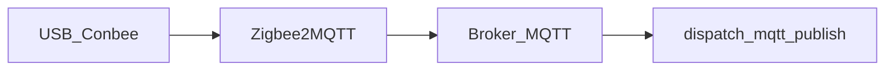

# Clé Conbee / Zigbee et rusthome

**rusthome ne parle pas Zigbee** : il ingère des événements via **MQTT** ([mqtt-contract.md](mqtt-contract.md)). Une clé **Conbee** (II ou III) est un coordinateur **USB série** ; pour l’appairage des capteurs et le réseau mesh, il faut un **pont logiciel** — en pratique **Zigbee2MQTT** (recommandé ici) ou **deCONZ** (Phoscon).

## Prérequis Linux

- **Accès série** : l’utilisateur qui lance Zigbee2MQTT doit pouvoir lire/écrire le périphérique (souvent groupe `dialout` : `sudo usermod -aG dialout "$USER"` puis reconnexion).
- **Chemin stable** : préférer un lien sous `/dev/serial/by-id/…` dans la config Z2M plutôt que `/dev/ttyACM0` (l’ordre peut changer au reboot).
- La page **Système** de rusthome liste les ports `ttyACM*` / `ttyUSB*` (indicatif, pas un pilote).

## Voie recommandée : Zigbee2MQTT + même broker que rusthome

Depuis le dépôt, **`rusthome init`** crée dans le répertoire data (par défaut `data/`) un `rusthome.toml` avec `[zigbee2mqtt]` et un modèle `zigbee2mqtt.configuration.suggested.yaml` (sans écraser les fichiers existants — utiliser `rusthome init --force` pour régénérer). Il ne reste plus qu’à **renseigner `serial.port`** (Conbee) et à placer le YAML au bon endroit côté Zigbee2MQTT (voir la section ci‑dessous).

### Où placer le fichier côté Zigbee2MQTT

Zigbee2MQTT ne lit en général qu’un seul nom de fichier : **`configuration.yaml`**, à l’intérieur de son **répertoire de données** (c’est ce répertoire qui contient aussi `database.db`, `state.json`, etc.). Le fichier généré par rusthome s’appelle `zigbee2mqtt.configuration.suggested.yaml` : c’est un **modèle** ; l’instance Z2M attend **`configuration.yaml`** (ou un montage explicite vers ce chemin, voir Docker).

- **Installation « sur disque » (script officiel, paquet, git + npm, etc.)** — L’emplacement exact dépend de la [méthode d’installation](https://www.zigbee2mqtt.io/guide/installation/01_linux.html) (souvent un dossier `data/` à côté des sources, ou un chemin de type `/opt/zigbee2mqtt/...`). Repérez le **`configuration.yaml` réel** de votre instance (souvent indiqué dans l’[assistant de démarrage](https://www.zigbee2mqtt.io/guide/configuration/) et dans l’[exemple de service systemd](https://www.zigbee2mqtt.io/guide/installation/01_linux.html#7-enable-and-start-optional)). Approche la plus simple : **copier** le contenu du modèle rusthome par‑dessus (ou `cp` vers ce chemin en sauvegardant l’ancien fichier).

- **systemd (service Linux)** — L’unité fournie par la doc pointe d’ordinaire un **`WorkingDirectory`** (répertoire de l’app Z2M) : le `configuration.yaml` actif est celui de ce **data directory** Z2M, pas celui de rusthome. Vérifiez avec : `systemctl cat zigbee2mqtt` (nom du service variable selon l’install).

- **Docker (image `koenkk/zigbee2mqtt`, souvent le cas sur Raspberry Pi)** — Le chemin **dans le conteneur** est en pratique **`/app/data/configuration.yaml`** ; le dossier `/app/data` contient toute la persistance Z2M. On monte un **dossier hôte** vers `/app/data`, par exemple `-v /chemin/vers/mes_donnees_z2m:/app/data`, puis on place sur l’hôte **`mes_donnees_z2m/configuration.yaml`** (copie du modèle `rusthome init` ou édition directe). Pour l’**USB**, le dongle série doit être visible dans le conteneur (souvent le même `by-id/...` qu’en bare metal) — voir [Installation Docker](https://www.zigbee2mqtt.io/guide/installation/02_docker.html). **Broker sur `127.0.0.1:1883` (rusthome sur l’hôte, Z2M en Docker)** : `127.0.0.1` *dans le conteneur* est le conteneur lui‑même, pas le broker sur la machine. Utilisez l’adresse **LAN du Pi**, le nom d’hôte du bridge Docker vers l’hôte, ou **`network_mode: host`** pour que `mqtt://127.0.0.1:1883` pointe le broker embarqué de `rusthome serve` sur le même OS.

- **Ne pas mélanger les dossiers** — Monter le dossier `data/` de rusthome *tel quel* en `/app/data` pour Z2M mélange le journal, `rusthome.toml` et la base Z2M. Préférez un **répertoire dédié** à Z2M sur l’hôte et **copiez** le YAML suggéré.

1. Installez **Zigbee2MQTT** (paquet, Docker ou script officiel) sur la même machine (ou un hôte qui joint le broker par **TCP**).
2. Dans `configuration.yaml` Z2M, pointez le **même broker MQTT** que celui utilisé par rusthome. Fichier d’exemple versionné dans le dépôt : [`configs/zigbee2mqtt.configuration.example.yaml`](../configs/zigbee2mqtt.configuration.example.yaml) (Conbee `serial` + `mqtt` → `127.0.0.1:1883`, `base_topic` aligné avec `[zigbee2mqtt]` dans `rusthome.toml`). Deux scénarios courants :
   - **broker embarqué** de `rusthome serve` (ex. `localhost:1883`, sans auth par défaut) : l’exemple pointe `mqtt://127.0.0.1:1883` ;
   - **Mosquitto** (ou autre) commun : rusthome et Z2M se connectent à ce **même** hôte:port.
3. Section **série** : `serial.port` = chemin stable vers la Conbee (voir [Zigbee2MQTT — adapter](https://www.zigbee2mqtt.io/guide/configuration/adapter-settings.html)).
4. **Mapper** les publications Z2M vers les topics attendus par rusthome : `sensors/motion/…`, `sensors/temperature/…`, `sensors/contact/…` ([mqtt-contract.md](mqtt-contract.md)). Possibilités :
   - **renommage / `friendly_name`** dans Z2M + règles de publication (selon version) ;
   - **Node-RED**, **Home Assistant** comme intermédiaire ;
   - petit script qui souscrit aux topics Z2M et republie au format rusthome.

Tant que les topics/payloads ne correspondent pas au contrat, rien n’apparaît dans le journal rusthome.

## Appairage (« recherche » de capteurs)

1. Dans l’**interface web Zigbee2MQTT** (ou via MQTT), lancez **Permit join** (durée limitée).
2. Mettez le capteur Zigbee en **mode appairage** (bouton, pile retirée/remise, etc.).
3. Le nœud apparaît dans Z2M ; configurez ensuite le **mapping** vers les topics rusthome.

Si Zigbee2MQTT utilise le **même broker** que `rusthome serve`, vous pouvez activer **« Autoriser l’appairage »** depuis la page **Système** de rusthome (section Zigbee2MQTT), après avoir ajouté une section `[zigbee2mqtt]` dans `rusthome.toml` (voir [configs/rusthome.example.toml](../configs/rusthome.example.toml)). Cela publie une requête `permit_join` sur le topic bridge standard Z2M.

**Indicateur « réseau ouvert à l’appairage » (permit join)** : avec `rusthome serve` et le **broker intégré**, le service d’ingest s’abonne au topic `<préfixe_MQTT>/bridge/info` (ex. `zigbee2mqtt/bridge/info` si le préfixe est `zigbee2mqtt`) et met en cache le champ `permit_join` publié par Zigbee2MQTT. La page **Système** et l’API `GET /api/zigbee2mqtt/bridge` reflètent cet état. Avec `rusthome serve --no-broker` ou le binaire **`rusthome-web` seul**, il n’y a pas d’abonnement MQTT dans le processus : l’indicateur indique que l’état n’est pas disponible (Z2M est tout de même pilotable via le bouton si le broker est joignable pour les publications). Tant que Zigbee2MQTT n’a **pas** republié `bridge/info` après le démarrage, le libellé peut rester sur « pas encore d’info ».

## Alternative : deCONZ + Phoscon

deCONZ gère la Conbee et expose Phoscon pour l’appairage. Il n’y a pas d’intégration MQTT native identique au contrat rusthome : il faudra **pont** (plugin, script, ou MQTT gateway) vers les topics `sensors/…`. Pour un chemin simple vers rusthome, **Zigbee2MQTT reste plus direct**.

## Dépannage

| Problème | Piste |
|----------|--------|
| Pas de `/dev/ttyACM*` | Câble USB, alimentation, `dmesg \| tail` après branchement |
| Permission denied | Groupe `dialout`, éviter de lancer Z2M en root sans bonne config udev |
| Z2M connecté mais rien dans rusthome | Vérifier broker **identique**, puis mapping des **topics** (voir [integration.md](integration.md)) |
| Bouton appairage rusthome sans effet | Broker embarqué actif, Z2M abonné au même broker, préfixe MQTT `[zigbee2mqtt]` aligné avec Z2M |
| Pastille permit join grise / jamais « ouvert » | Vérifier que Z2M publie `bridge/info` sur ce broker (même préfixe) ; payload trop gros (limite 512 kB côté broker embarqué) ; le coordinateur ferme l’ouverture à la fin du timer côté Z2M |

## Checklist « ajouter un capteur »

Procédure pas à pas (broker partagé, mapping topics, tests) : section **Checklist** dans [integration.md](integration.md).

## Voir aussi

- [mqtt-contract.md](mqtt-contract.md) — contrat versionné des topics
- [integration.md](integration.md) — golden path et exemples
- [adapters-and-bridges.md](adapters-and-bridges.md) — binaire **`rusthome-bridge`** (Z2M → topics `sensors/…`)
- [presence-bridge.md](presence-bridge.md) — BLE vs Zigbee (ne pas confondre)
