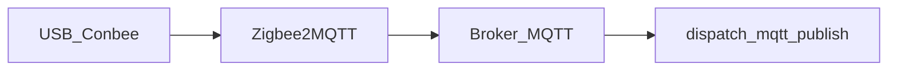

# Clé Conbee / Zigbee et rusthome

**rusthome ne parle pas Zigbee** : il ingère des événements via **MQTT** ([mqtt-contract.md](mqtt-contract.md)). Une clé **Conbee** (II ou III) est un coordinateur **USB série** ; pour l’appairage des capteurs et le réseau mesh, il faut un **pont logiciel** — en pratique **Zigbee2MQTT** (recommandé ici) ou **deCONZ** (Phoscon).

## Prérequis Linux

- **Accès série** : l’utilisateur qui lance Zigbee2MQTT doit pouvoir lire/écrire le périphérique (souvent groupe `dialout` : `sudo usermod -aG dialout "$USER"` puis reconnexion).
- **Chemin stable** : préférer un lien sous `/dev/serial/by-id/…` dans la config Z2M plutôt que `/dev/ttyACM0` (l’ordre peut changer au reboot).
- La page **Système** de rusthome liste les ports `ttyACM*` / `ttyUSB*` (indicatif, pas un pilote).

## Voie recommandée : Zigbee2MQTT + même broker que rusthome

1. Installez **Zigbee2MQTT** (paquet, Docker ou script officiel) sur la même machine (ou un hôte qui joint le broker par **TCP**).
2. Dans `configuration.yaml` Z2M, pointez le **même broker MQTT** que celui utilisé par rusthome :
   - soit le **broker embarqué** de `rusthome serve` (ex. `localhost:1883`, sans auth par défaut) ;
   - soit un **Mosquitto** commun : rusthome et Z2M se connectent tous les deux à ce broker.
3. Section **série** : `serial.port` = chemin stable vers la Conbee (voir [Zigbee2MQTT — adapter](https://www.zigbee2mqtt.io/guide/configuration/adapter-settings.html)).
4. **Mapper** les publications Z2M vers les topics attendus par rusthome : `sensors/motion/…`, `sensors/temperature/…`, `sensors/contact/…` ([mqtt-contract.md](mqtt-contract.md)). Possibilités :
   - **renommage / `friendly_name`** dans Z2M + règles de publication (selon version) ;
   - **Node-RED**, **Home Assistant** comme intermédiaire ;
   - petit script qui souscrit aux topics Z2M et republie au format rusthome.

Tant que les topics/payloads ne correspondent pas au contrat, rien n’apparaît dans le journal rusthome.

## Appairage (« recherche » de capteurs)

1. Dans l’**interface web Zigbee2MQTT** (ou via MQTT), lancez **Permit join** (durée limitée).
2. Mettez le capteur Zigbee en **mode appairage** (bouton, pile retirée/remise, etc.).
3. Le nœud apparaît dans Z2M ; configurez ensuite le **mapping** vers les topics rusthome.

Si Zigbee2MQTT utilise le **même broker** que `rusthome serve`, vous pouvez activer **« Autoriser l’appairage »** depuis la page **Système** de rusthome (section Zigbee2MQTT), après avoir ajouté une section `[zigbee2mqtt]` dans `rusthome.toml` (voir [configs/rusthome.example.toml](../configs/rusthome.example.toml)). Cela publie une requête `permit_join` sur le topic bridge standard Z2M.

## Alternative : deCONZ + Phoscon

deCONZ gère la Conbee et expose Phoscon pour l’appairage. Il n’y a pas d’intégration MQTT native identique au contrat rusthome : il faudra **pont** (plugin, script, ou MQTT gateway) vers les topics `sensors/…`. Pour un chemin simple vers rusthome, **Zigbee2MQTT reste plus direct**.

## Dépannage

| Problème | Piste |
|----------|--------|
| Pas de `/dev/ttyACM*` | Câble USB, alimentation, `dmesg \| tail` après branchement |
| Permission denied | Groupe `dialout`, éviter de lancer Z2M en root sans bonne config udev |
| Z2M connecté mais rien dans rusthome | Vérifier broker **identique**, puis mapping des **topics** (voir [integration.md](integration.md)) |
| Bouton appairage rusthome sans effet | Broker embarqué actif, Z2M abonné au même broker, préfixe MQTT `[zigbee2mqtt]` aligné avec Z2M |

## Voir aussi

- [mqtt-contract.md](mqtt-contract.md) — contrat versionné des topics
- [integration.md](integration.md) — golden path et exemples
- [presence-bridge.md](presence-bridge.md) — BLE vs Zigbee (ne pas confondre)
